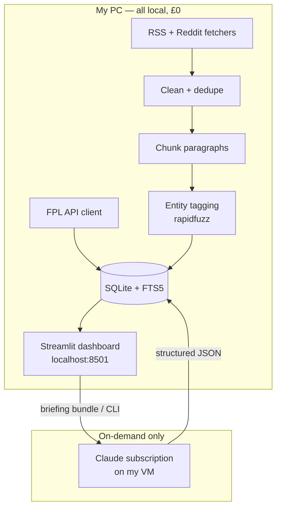

# FPL Squad Assistant — Solution Design & Decision Log

**Status:** Draft v1.0
**Date:** 2026-08-28
**Companion to:** [technical-specification.md](technical-specification.md)

This document explains *how* the system is designed and *why* — the architecture, the key
design decisions (with alternatives considered), the component design, and the data flow.

---

## 1. Design goals

1. **£0 recurring cost** and **fully local** operation.
2. **No models or paid APIs on device** — AI comes from my personal **Claude subscription**.
3. **Core works without AI** — data + keyword search are useful on their own.
4. **Simple to run** — one Python env, one SQLite file, one Streamlit command.
5. **Pluggable AI boundary** — easy to swap/extend the insights provider later.

---

## 2. High-level architecture

**Layering:** Ingestion → Storage → Retrieval → (optional) Insights → Presentation.
Each layer talks only to the one beside it, so the AI layer can be absent or replaced
without affecting the rest.

---

## 3. Component design

### 3.1 Ingestion
- `fpl_client.py` — thin wrapper over FPL endpoints; caches responses; ≤1 req/sec.
- `news_fetch.py` — `feedparser` for RSS + Reddit `.json`; normalises to a common record.
- `pipeline.py` — clean → dedupe → chunk → tag → persist. Idempotent; safe to re-run.

### 3.2 Storage
- Single **SQLite** DB (`data/fpl.sqlite`). FPL tables + `news_*` tables.
- **FTS5** virtual table `news_chunks_fts` for keyword/BM25 search.
- Chosen for zero-config, single-file portability, and built-in full-text search.

### 3.3 Retrieval
- `search.py` — builds FTS5 queries from player aliases + intent keywords + recency window;
  returns ranked chunks with source/date. No network, no models.

### 3.4 Insights (pluggable)
- `insights/base.py` — `InsightsProvider` interface: `summarise(player, chunks) -> Insight`.
- `insights/null_provider.py` — default; rule-based flags only, no AI.
- `insights/claude_provider.py` — routes to Claude subscription (Mode A bundle export /
  Mode B `claude` CLI). Validates JSON output against a schema before storing.

### 3.5 Presentation
- `app.py` — Streamlit. Pages: Squad, News, Transfers, Template, Captaincy.
- Reads from SQLite; triggers insights on demand via a button (never automatically, to keep
  AI usage minimal and intentional).

---

## 4. Data flow (week-on-week use)

1. Run ingestion (manually or scheduled) → FPL data + fresh news land in SQLite.
2. Open Streamlit → squad board shows ownership, fixtures, transfer trends, rule-based risk.
3. For any doubtful player → click **Insights** → app gathers the top news chunks → hands
   them to Claude → structured availability summary + badge saved and displayed.
4. Use Transfers/Template/Captaincy pages to decide changes before the deadline.

---

## 5. Design decision log

| ID | Decision | Alternatives considered | Rationale |
|----|----------|-------------------------|-----------|
| D-1 | **Local-first, single-machine** | Cloud web app, hosted DB | Meets £0-cost + privacy; single user; no ops. |
| D-2 | **Streamlit UI** | FastAPI+React, Tauri desktop app | Fastest to build, free, good enough for one user; Tauri kept as future option. |
| D-3 | **SQLite + FTS5** | Postgres, DuckDB, external vector DB | Zero-config, single file, built-in full-text search; no server. |
| D-4 | **Keyword search (FTS5), no embeddings in v1** | Local embeddings, cloud embeddings | No models on device; FTS5 covers ~90% of FPL chatter needs at £0. |
| D-5 | **AI via personal Claude subscription** | Cloud LLM API (OpenAI/Gemini), local LLM (Ollama) | No API key/cost; no models on device; uses a subscription I already own. |
| D-6 | **Pluggable `InsightsProvider`, Null default** | Hard-wire Claude | Core stays usable offline/AI-free; easy to swap providers later. |
| D-7 | **`rapidfuzz` entity tagging** | LLM/NER-based tagging | Deterministic, fast, free, no model; disambiguate with team context. |
| D-8 | **RSS + Reddit only** | X/Twitter API, premium FFS | Free and ToS-friendly; paid sources excluded. |
| D-9 | **On-demand insights (button), not per-ingest** | Summarise every article | Minimises AI usage; keeps handoffs intentional and cheap. |

---

## 6. Risks & mitigations

| Risk | Impact | Mitigation |
|------|--------|-----------|
| FPL API shape changes | Ingestion breaks | Wrap in client; validate; pin field access. |
| News source ToS / rate limits | Blocked fetches | RSS-first, caching, backoff, ≤1 req/sec. |
| Player name ambiguity (e.g. two "Silva") | Wrong tags | Fuzzy score threshold + team-context disambiguation. |
| Manual Claude handoff friction (Mode A) | Slower insights | Add Mode B (`claude` CLI) when available on VM. |
| Stale news polluting results | Bad decisions | Recency window filter (default 10 days). |
| Scope creep | Never ships | Strict phased delivery; Phase 1 is data-only. |

---

## 7. Assumptions

- **Assumption:** Runs on my Windows PC; 8 GB RAM is sufficient (no local models).
- **Assumption:** My Claude subscription/VM is available for on-demand insight calls.
- **Assumption:** Single user; no need for auth, multi-tenancy, or hosting.
- **Assumption:** Free RSS/Reddit sources provide adequate injury/availability chatter.

---

## 8. Future extensions (not in v1)

- **Tier-2 semantic search** via an embedding route (would need a model or embedding
  service — deferred to preserve £0 / no-model constraints).
- **Mode B automation** of Claude via CLI for hands-free insights.
- **Tauri packaging** for a native installable desktop app.
- **LAN access** so the dashboard is viewable on my phone over home Wi-Fi.
