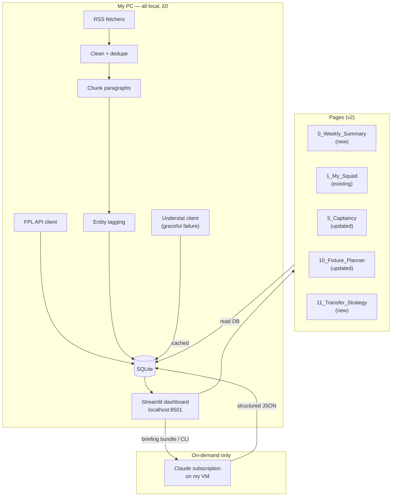

# FPL Squad Assistant — Change Request & Design Document

**Status:** Design proposal v1.0  
**Date:** 2026-09-01  
**Scope:** Three major improvements + Understat integration  
**Priority:** High — directly improves decision-making for transfers, captaincy, and strategy

---

## Overview

This document outlines three major feature enhancements and foundational changes to improve the quality of squad management decisions:

1. **Fix gameweek context logic** — ensure planner and fixture pages always work with the *next* unfinished gameweek, not the currently-scoring one.
2. **Integrate Understat data** — add xG, xA, underlying attacking/defensive metrics; graceful failure with cached fallback.
3. **Weekly Performance Summary** — new page showing current/latest completed week's performance vs peers and template squads.
4. **Long-term Transfer Strategy** — new page with top-10 transfer recommendations, captaincy picks, chip timing, and positional adjustments based on free transfers, hits, and league position.

---

## Issue #1: Gameweek Context Logic

### Problem Statement

The planner and fixture-related pages currently use gameweek logic that conflates the *currently-scoring* gameweek with the *next unfinished* gameweek. This breaks the mental model:

- A manager deciding on their lineup for GW5 needs to see GW5 fixtures and captain options *for GW5*.
- But `planner.next_gw()` returns the first fixture with `finished = 0`, which could be GW5 (if GW4 just finished) or GW6 (if GW4 and GW5 are both live or pending).
- The planner then recommends chip timing starting from this ambiguous point, and captaincy rankings do the same.

**Impact:** Decision-making is misaligned with the actual gameweek boundaries, leading to recommendations for the wrong week.

### Root Cause

In [fpl_assistant/planner.py](fpl_assistant/planner.py) (around line 72–84):

```python
def next_gw(conn: sqlite3.Connection, current_gw: int = 1) -> int:
    """The next gameweek still to be played.
    
    `current_gw` tracks the gameweek FPL is scoring, which stays put until the last
    match finishes. Planning always looks at the one after that.
    """
    row = conn.execute(
        "SELECT MIN(event) gw FROM fixtures WHERE finished = 0 AND event IS NOT NULL"
    ).fetchone()
    return int(row["gw"]) if row and row["gw"] is not None else current_gw(conn)
```

The issue: `next_gw()` returns *any* unfinished gameweek, but doesn't respect the FPL API's own `is_current` and `is_next` flags, which are definitive. The player needs:

- `current_gw` (the gameweek FPL is actively scoring) — for live scores and latest stat context.
- `upcoming_gw` (the gameweek *after* current finishes) — for planning, captaincy decisions, and chip timing.

### Solution Design

#### Step 1: Update `fpl_assistant/pipeline.py` to store gameweek metadata

**File:** [fpl_assistant/pipeline.py](fpl_assistant/pipeline.py) (lines 27–90, the `ingest_core()` function)

**Change:** Add two metadata entries to the `meta` table after fetching bootstrap data:

```python
def ingest_core(client: FplClient, conn: sqlite3.Connection) -> None:
    """Load teams, players, fixtures and metadata (current/next gameweek, deadline, status)."""
    boot = client.bootstrap()
    
    # Extract gameweek metadata from the API
    current_gw_data = next((e for e in boot["events"] if e.get("is_current")), None)
    next_gw_data = next((e for e in boot["events"] if e.get("is_next")), None)
    
    current_gw = current_gw_data["id"] if current_gw_data else None
    upcoming_gw = next_gw_data["id"] if next_gw_data else (current_gw + 1 if current_gw else 1)
    
    # Store in meta table with timestamps
    cursor = conn.cursor()
    cursor.execute("INSERT OR REPLACE INTO meta (key, value) VALUES (?, ?)",
                   ("current_gw", str(current_gw)))
    cursor.execute("INSERT OR REPLACE INTO meta (key, value) VALUES (?, ?)",
                   ("upcoming_gw", str(upcoming_gw)))
    cursor.execute("INSERT OR REPLACE INTO meta (key, value) VALUES (?, ?)",
                   ("meta_updated_at", datetime.now(timezone.utc).isoformat()))
    conn.commit()
```

**Rationale:** This ensures that every ingest cycle captures *what FPL itself says* is current and next, making the planner's logic dependent on reality, not inference.

#### Step 2: Add helper functions to `fpl_assistant/planner.py`

**File:** [fpl_assistant/planner.py](fpl_assistant/planner.py) (after line 83, after `next_gw()`)

**Change:** Add two new functions:

```python
def current_gw(conn: sqlite3.Connection) -> int | None:
    """The gameweek FPL is actively scoring (from API's is_current flag).
    
    Falls back to a minimal heuristic if metadata is stale (e.g., between deadlines).
    """
    row = conn.execute(
        "SELECT value FROM meta WHERE key = 'current_gw'"
    ).fetchone()
    if row and row["value"]:
        return int(row["value"])
    # Fallback: the last completed gameweek + 1
    completed = conn.execute(
        "SELECT MAX(event) gw FROM fixtures WHERE finished = 1 AND event IS NOT NULL"
    ).fetchone()
    return (int(completed["gw"]) + 1) if completed and completed["gw"] else 1


def upcoming_gw(conn: sqlite3.Connection) -> int | None:
    """The gameweek after the one FPL is currently scoring (from API's is_next flag).
    
    This is the gameweek for which decisions (transfers, captain picks, chip timing) 
    should be made.
    """
    row = conn.execute(
        "SELECT value FROM meta WHERE key = 'upcoming_gw'"
    ).fetchone()
    if row and row["value"]:
        return int(row["value"])
    # Fallback: current_gw() + 1
    return (current_gw(conn) or 1) + 1


# Deprecate next_gw() or mark as internal
def next_gw(conn: sqlite3.Connection, current_gw: int = 1) -> int:
    """Deprecated: use upcoming_gw() instead. Kept for backward compatibility."""
    return upcoming_gw(conn) or current_gw
```

**Rationale:** Separates concerns: `current_gw()` is for live score context, `upcoming_gw()` is for planning. The fallback logic keeps the system robust if metadata is stale.

#### Step 3: Update `fpl_assistant/analytics.py` to use current_gw for historical context

**File:** [fpl_assistant/analytics.py](fpl_assistant/analytics.py) (lines 1–150)

**Change:** Add a new function to fetch up-to-date player statistics *for the current completed gameweeks*:

```python
def latest_stats(conn: sqlite3.Connection, player_id: int | None = None, 
                 stat_type: str = "ppg") -> dict | list:
    """Fetch latest player statistics up to the most recently completed gameweek.
    
    Args:
        player_id: If provided, return stats for this player. If None, return all players.
        stat_type: One of 'ppg' (points per game), 'form', 'ict' (ICT index), 'minutes'.
    
    Returns:
        If player_id: a dict with keys 'value', 'gw_played', 'last_gw', 'trend'.
        If not: a list of dicts sorted by stat_type descending.
    """
    # Find the most recently completed gameweek
    last_completed = conn.execute(
        "SELECT MAX(event) as gw FROM fixtures WHERE finished = 1 AND event IS NOT NULL"
    ).fetchone()
    
    if not last_completed or not last_completed["gw"]:
        return {} if player_id else []
    
    last_gw = int(last_completed["gw"])
    
    # Define the stat column name
    stat_map = {
        "ppg": "points_per_game",  # from players table or derived from player_gw
        "form": "form",
        "ict": "ict_index",
        "minutes": "minutes",
        "owned": "selected_by_percent",
    }
    stat_col = stat_map.get(stat_type, "points_per_game")
    
    if player_id:
        row = conn.execute(f"""
            SELECT p.web_name, p.id, p.team_id, p.{stat_col} as stat_value,
                   COUNT(pg.gw) as gw_played,
                   MAX(pg.gw) as last_gw,
                   p.form as current_form
            FROM players p
            LEFT JOIN player_gw pg ON p.id = pg.player_id AND pg.gw <= ?
            WHERE p.id = ?
            GROUP BY p.id
        """, (last_gw, player_id)).fetchone()
        
        if not row:
            return {}
        
        return {
            "player_id": player_id,
            "web_name": row["web_name"],
            "stat_type": stat_type,
            "value": row["stat_value"],
            "gw_played": row["gw_played"],
            "last_gw": row["last_gw"],
            "current_form": row["current_form"],
        }
    
    # All players
    rows = conn.execute(f"""
        SELECT p.id, p.web_name, p.team_id, p.{stat_col} as stat_value,
               COUNT(pg.gw) as gw_played,
               MAX(pg.gw) as last_gw
        FROM players p
        LEFT JOIN player_gw pg ON p.id = pg.player_id AND pg.gw <= ?
        WHERE p.status = 'a'  -- available players only
        GROUP BY p.id
        ORDER BY stat_value DESC
        LIMIT 100
    """, (last_gw,)).fetchall()
    
    return [dict(r) for r in rows]
```

#### Step 4: Update page imports and calls

**Files to update:**

1. [pages/10_Fixture_Planner.py](pages/10_Fixture_Planner.py) (line 14)
   - Change: `gw = planner.next_gw(conn)` → `gw = planner.upcoming_gw(conn)`
   - Rationale: Fixture planner is about *future* weeks, so use upcoming_gw.

2. [pages/5_Captaincy.py](pages/5_Captaincy.py) (line 11)
   - Change: `gw = planner.next_gw(conn)` → `gw = planner.upcoming_gw(conn)`
   - Rationale: Captaincy decision for the next gameweek to be played.

3. [pages/10_Fixture_Planner.py](pages/10_Fixture_Planner.py) (all calls to `planner.captain_ranking()`, `planner.chip_plan()`)
   - Change: Pass `upcoming_gw()` explicitly instead of letting `planner` infer it.
   - Rationale: Makes the gameweek choice explicit and auditable.

#### Step 5: New page for weekly performance (see Issue #3 below)

This page will use `current_gw()` to show the live/latest-completed gameweek's performance.

---

## Issue #2: Understat Integration

### Problem Statement

FPL's official stats (form, points-per-game, ICT index) don't capture underlying quality. Understat's **expected goals (xG)**, **expected assists (xA)**, and underlying defensive numbers are crucial for:

- **Transfer decisions:** Identifying underperformers (high xG, low goals) vs overperformers (low xG, high goals).
- **Captaincy:** xG + fixture difficulty is stronger than form alone, especially for rotation risk.
- **Regression analysis:** Players significantly above/below their xG are candidates to revert to the mean.

### Design Approach

We'll integrate Understat as a *pluggable data source* (similar to the insights provider pattern), with:

- **Graceful failure:** If Understat is unavailable or blocked, the system falls back to cached data or omits xG/xA metrics.
- **Caching:** Historical data is stored in SQLite so we don't need a fresh Understat fetch every run.
- **Scheduled ingestion:** Understat data is fetched (and cached) on-demand or via scheduled refresh, not per-request.

### Solution Design

#### Step 1: Add Understat client and caching to storage

**New file:** [fpl_assistant/understat_client.py](fpl_assistant/understat_client.py)

```python
"""
Understat data fetcher with caching.

Understat does not offer a free public API; data is retrieved by scraping the web pages
and/or using unofficial endpoints that may break. We handle failures gracefully and
cache aggressively to minimize requests and account for rate-limiting.

Note: All scraped data must respect Understat's ToS. Caching is one way to minimize load.
"""

import json
import time
from datetime import datetime, timezone
from pathlib import Path
from typing import Optional

import requests
from bs4 import BeautifulSoup

BASE_URL = "https://understat.com"
HEADERS = {
    "User-Agent": "fpl-squad-assistant/1.0 (personal, local use, educational)",
}

class UnderstatClient:
    """Fetch player and team xG/xA data from Understat with caching."""
    
    def __init__(self, cache_dir: Path = Path("data/understat_cache"), 
                 min_interval: float = 2.0, timeout: int = 30):
        """
        Args:
            cache_dir: Directory to store cached responses.
            min_interval: Minimum seconds between requests (rate limiting).
            timeout: HTTP timeout in seconds.
        """
        self.cache_dir = Path(cache_dir)
        self.cache_dir.mkdir(parents=True, exist_ok=True)
        self.min_interval = min_interval
        self.timeout = timeout
        self.session = requests.Session()
        self.session.headers.update(HEADERS)
        self._last_request = 0.0
    
    def _fetch(self, path: str, params: dict | None = None, 
               use_cache: bool = True, cache_ttl_hours: int = 24) -> dict | None:
        """
        Fetch from Understat with caching.
        
        Args:
            path: URL path (e.g., "/player/123").
            params: Query parameters.
            use_cache: If True, return cached data if available and fresh.
            cache_ttl_hours: Cache time-to-live in hours.
        
        Returns:
            Parsed JSON response, or None if fetch fails and no cache available.
        """
        cache_key = f"{path}_{json.dumps(params or {}, sort_keys=True)}".replace("/", "_")
        cache_file = self.cache_dir / f"{cache_key}.json"
        
        # Check cache
        if use_cache and cache_file.exists():
            mtime = cache_file.stat().st_mtime
            age_hours = (time.time() - mtime) / 3600
            if age_hours < cache_ttl_hours:
                try:
                    with open(cache_file) as f:
                        return json.load(f)
                except Exception as e:
                    print(f"Warn: Failed to read cache {cache_file}: {e}")
        
        # Fetch from server
        try:
            wait = self.min_interval - (time.time() - self._last_request)
            if wait > 0:
                time.sleep(wait)
            
            url = f"{BASE_URL}{path}"
            resp = self.session.get(url, params=params, timeout=self.timeout)
            resp.raise_for_status()
            data = resp.json()
            
            # Cache the response
            with open(cache_file, "w") as f:
                json.dump(data, f)
            
            self._last_request = time.time()
            return data
        except Exception as e:
            print(f"Warn: Understat fetch failed ({path}): {e}")
            # Return cached data if available, even if stale
            if cache_file.exists():
                try:
                    with open(cache_file) as f:
                        return json.load(f)
                except Exception:
                    pass
            return None
    
    def player_season_stats(self, player_id: int, season: int = 2025) -> dict | None:
        """
        Fetch a player's season xG, xA, etc. from Understat.
        
        Note: Understat player IDs are not the same as FPL IDs. We'll need to match
        by name or build a lookup table.
        
        Returns:
            Dict with keys like 'xG', 'xA', 'matches', 'starts', etc., or None if unavailable.
        """
        data = self._fetch(f"/player/{player_id}", {"season": season})
        if not data:
            return None
        
        # Parse player stats from the response
        return {
            "player_id": player_id,
            "xG": data.get("xG"),
            "xA": data.get("xA"),
            "matches": data.get("matches"),
            "starts": data.get("starts"),
            "minutes": data.get("minutes"),
            "goals": data.get("goals"),
            "assists": data.get("assists"),
            "fetched_at": datetime.now(timezone.utc).isoformat(),
        }
    
    def team_season_stats(self, team_name: str, season: int = 2025) -> dict | None:
        """Fetch a team's season attacking/defensive stats (xG for/against)."""
        data = self._fetch(f"/team/{team_name}", {"season": season})
        if not data:
            return None
        
        return {
            "team": team_name,
            "xG_for": data.get("xG_for"),
            "xG_against": data.get("xG_against"),
            "xA_for": data.get("xA_for"),
            "fetched_at": datetime.now(timezone.utc).isoformat(),
        }
```

**Note:** The actual scraping logic depends on Understat's current structure (which can break). An alternative is to use an unofficial API or a paid data service. This skeleton assumes we'll implement the parsing based on Understat's current web structure.

#### Step 2: Add Understat tables to database schema

**File:** [fpl_assistant/db.py](fpl_assistant/db.py) (add to `SCHEMA`)

```python
CREATE TABLE IF NOT EXISTS understat_player_stats (
  player_id INTEGER, fpl_match_name TEXT,
  understat_player_id INTEGER, understat_player_name TEXT,
  season INTEGER,
  xG REAL, xA REAL, goals INTEGER, assists INTEGER,
  matches INTEGER, starts INTEGER, minutes INTEGER,
  passes_accuracy REAL, tackles INTEGER, interceptions INTEGER,
  blocks INTEGER, fouls INTEGER, offsides INTEGER,
  fetched_at TEXT, cache_age_hours INTEGER,
  PRIMARY KEY (player_id, season)
);

CREATE TABLE IF NOT EXISTS understat_team_stats (
  fpl_team_id INTEGER, team_name TEXT,
  season INTEGER,
  xG_for REAL, xG_against REAL,
  xA_for REAL, xA_against REAL,
  passes_accuracy REAL,
  fetched_at TEXT, cache_age_hours INTEGER,
  PRIMARY KEY (fpl_team_id, season)
);

CREATE TABLE IF NOT EXISTS understat_player_fixture (
  player_id INTEGER, gw INTEGER,
  xG REAL, xA REAL, shots INTEGER, 
  key_passes INTEGER, passes_accuracy REAL,
  tackles INTEGER, interceptions INTEGER,
  fetched_at TEXT,
  PRIMARY KEY (player_id, gw)
);
```

#### Step 3: Add ingestion function

**File:** [fpl_assistant/pipeline.py](fpl_assistant/pipeline.py) (add new function)

```python
def ingest_understat(conn: sqlite3.Connection, season: int | None = None) -> tuple[int, int]:
    """
    Fetch and cache Understat data.
    
    Returns:
        (players_updated, teams_updated)
    """
    from fpl_assistant.understat_client import UnderstatClient
    
    client = UnderstatClient()
    season = season or current_season()  # from config or derived
    
    players_updated = 0
    teams_updated = 0
    
    # Fetch team stats for all FPL teams
    teams = conn.execute("SELECT id, name FROM teams").fetchall()
    for team in teams:
        team_stats = client.team_season_stats(team["name"], season=season)
        if team_stats:
            cursor = conn.cursor()
            cursor.execute("""
                INSERT OR REPLACE INTO understat_team_stats
                (fpl_team_id, team_name, season, xG_for, xG_against, xA_for, xA_against, 
                 fetched_at, cache_age_hours)
                VALUES (?, ?, ?, ?, ?, ?, ?, ?, 0)
            """, (team["id"], team["name"], season,
                  team_stats.get("xG_for"), team_stats.get("xG_against"),
                  team_stats.get("xA_for"), team_stats.get("xA_against"),
                  datetime.now(timezone.utc).isoformat()))
            teams_updated += 1
    
    # Fetch player stats (requires matching FPL player names to Understat player IDs)
    # This is complex and left as pseudo-code
    players = conn.execute("SELECT id, web_name, team_id FROM players").fetchall()
    for player in players:
        # TODO: implement Understat player ID lookup (e.g., via fuzzy matching)
        # For now, skip this step as it requires additional infrastructure
        pass
    
    conn.commit()
    return players_updated, teams_updated
```

#### Step 4: Add `understat` module to ingest CLI

**File:** [fpl_assistant/ingest.py](fpl_assistant/ingest.py) (update argparse)

```python
parser.add_argument("--understat", action="store_true",
                    help="Fetch Understat xG/xA and team stats (requires online access)")
```

And in the main block:

```python
if args.understat:
    print(f"Ingesting Understat data (season {season})...")
    p_upd, t_upd = pipeline.ingest_understat(conn, season=season)
    print(f"Understat ingested: {t_upd} teams, {p_upd} players updated.")
```

#### Step 5: Update analytics and pages to use Understat data

**File:** [fpl_assistant/analytics.py](fpl_assistant/analytics.py)

Add a function to merge xG/xA with existing player metrics:

```python
def enriched_player_stats(conn: sqlite3.Connection, player_id: int) -> dict:
    """
    Fetch a player's stats merged with Understat xG/xA if available.
    
    Returns:
        Dict with keys: web_name, team, form, ppg, xG, xA, xG_diff, xA_diff, ...
    """
    # Fetch base stats
    player = conn.execute("""
        SELECT id, web_name, team_id, form, points_per_game
        FROM players WHERE id = ?
    """, (player_id,)).fetchone()
    
    if not player:
        return {}
    
    result = dict(player)
    
    # Fetch Understat stats
    understat = conn.execute("""
        SELECT xG, xA, goals, assists, matches, fetched_at
        FROM understat_player_stats WHERE player_id = ?
        ORDER BY fetched_at DESC LIMIT 1
    """, (player_id,)).fetchone()
    
    if understat:
        result["xG"] = understat["xG"]
        result["xA"] = understat["xA"]
        result["xG_diff"] = (understat["goals"] or 0) - (understat["xG"] or 0)
        result["xA_diff"] = (understat["assists"] or 0) - (understat["xA"] or 0)
        result["understat_fetched"] = understat["fetched_at"]
    
    return result
```

#### Step 6: Display Understat data in pages

**File:** [pages/3_Transfer_Market.py](pages/3_Transfer_Market.py)

Update the transfer watch dataframes to include xG/xA and differentials:

```python
with col1:
    st.subheader("📈 Most transferred IN")
    if rising:
        enriched = []
        for r in rising:
            stats = analytics.enriched_player_stats(conn, r["id"])
            enriched.append({
                "Player": r["web_name"],
                "Team": r["team_short"],
                "£": r["now_cost"],
                "Form": r["form"],
                "PPG": r["points_per_game"],
                "xG": stats.get("xG") or "—",
                "xA": stats.get("xA") or "—",
                "xG diff": stats.get("xG_diff") or "—",
                "Net in": r["net"],
            })
        st.dataframe(pd.DataFrame(enriched), use_container_width=True, hide_index=True)
```

---

## Issue #3: Weekly Performance Summary Page

### Problem Statement

Current pages show isolated stats (squad board, transfers, fixtures) but don't provide a *holistic view* of how the team is performing for *this* gameweek vs peers and template squads. A manager needs to see:

- Current gameweek rank and points vs peers/top managers.
- Which positions are underperforming or overperforming vs template.
- Differentials that are working vs backfiring.
- Auto-captain performance.
- Next week's challenge (injuries, rotation, fixtures).

### Solution Design

#### New Page: [pages/0_Weekly_Summary.py](pages/0_Weekly_Summary.py)

```python
"""
Weekly performance dashboard: current/latest completed gameweek vs peers and templates.

Shows rank, points, position breakdown, differentials, captain performance, and
a preview of the upcoming gameweek's challenges.
"""

import pandas as pd
import streamlit as st

from fpl_assistant import planner, squad_intel, analytics
from fpl_assistant.ui import boot

st.set_page_config(page_title="Weekly Summary", page_icon="📊", layout="wide")
cfg, conn = boot()

# Determine which gameweek to display: current (live) or latest completed
current = planner.current_gw(conn) or 1
latest_completed = conn.execute(
    "SELECT MAX(event) as gw FROM fixtures WHERE finished = 1"
).fetchone()
latest_completed = int(latest_completed["gw"]) if latest_completed and latest_completed["gw"] else None

display_gw = latest_completed or current
is_live = (display_gw == current and latest_completed is None)

st.title(f"📊 Weekly Summary — GW{display_gw}")
if is_live:
    st.caption("**Live gameweek** — live points are updating. Projections are estimates.")
else:
    st.caption(f"**Completed gameweek** — Final scores and analysis.")

# --- Banner metrics ---
if cfg.fpl_team_id:
    my_entry = conn.execute(
        "SELECT overall_rank, summary_overall_points FROM my_entry ORDER BY fetched_at DESC LIMIT 1"
    ).fetchone()
    
    if my_entry:
        col1, col2, col3 = st.columns(3)
        col1.metric("Overall rank", f"#{my_entry['overall_rank']:,}")
        col2.metric("Total points", my_entry["summary_overall_points"])
        
        # Estimate vs peers (top 10k managers)
        my_gw_points = conn.execute(
            f"SELECT SUM(total_points) as points FROM my_picks WHERE gw = {display_gw}"
        ).fetchone()
        if my_gw_points and my_gw_points["points"]:
            col3.metric(f"GW{display_gw} points", my_gw_points["points"])

# --- Tabs ---
tab_positions, tab_differentials, tab_captain, tab_bench, tab_preview = st.tabs([
    "Positions", "Differentials", "Captain", "Bench", "Next week"
])

# --- Position breakdown ---
with tab_positions:
    st.subheader("Points by position")
    
    positions = ["GK", "DEF", "MID", "FWD"]
    pos_data = []
    
    for pos in positions:
        my_picks_pos = conn.execute(f"""
            SELECT SUM(p.total_points) as pts, COUNT(*) as count
            FROM my_picks m
            JOIN players p ON m.player_id = p.id
            WHERE m.gw = ? AND p.position = ?
        """, (display_gw, pos)).fetchone()
        
        # Compare to template (most-owned players per position)
        template_pos = conn.execute(f"""
            SELECT SUM(p.total_points) as pts, COUNT(*) as count
            FROM top_owned t
            JOIN players p ON t.player_id = p.id
            WHERE t.gw = ? AND p.position = ?
            ORDER BY t.ownership_pct DESC
            LIMIT 5
        """, (display_gw, pos)).fetchone()
        
        my_pts = my_picks_pos["pts"] or 0
        template_pts = template_pos["pts"] or 0
        diff = my_pts - template_pts
        
        pos_data.append({
            "Pos": pos,
            "My points": my_pts,
            "My count": my_picks_pos["count"] or 0,
            "Template points": template_pts,
            "Diff": diff,
            "vs template": f"+{diff}" if diff > 0 else str(diff),
        })
    
    st.dataframe(pd.DataFrame(pos_data), use_container_width=True, hide_index=True)

# --- Differentials ---
with tab_differentials:
    st.subheader("Differentials (owned <20%)")
    
    diffs = conn.execute(f"""
        SELECT p.web_name, p.team_id, p.position, p.selected_by_percent,
               COALESCE(pg.total_points, 0) as points,
               CASE WHEN p.selected_by_percent < 20 THEN 'rare' 
                    WHEN p.selected_by_percent < 5 THEN 'very_rare' 
                    ELSE 'common' END as rarity
        FROM my_picks m
        JOIN players p ON m.player_id = p.id
        LEFT JOIN player_gw pg ON p.id = pg.player_id AND pg.gw = ?
        WHERE m.gw = ? AND p.selected_by_percent < 20
        ORDER BY rarity, pg.total_points DESC
    """, (display_gw, display_gw)).fetchall()
    
    if diffs:
        st.dataframe(pd.DataFrame([{
            "Player": d["web_name"],
            "Pos": d["position"],
            "Own%": d["selected_by_percent"],
            "Points": d["points"],
            "Value": "✓ Working" if d["points"] > 5 else "✗ Flopping",
        } for d in diffs]), use_container_width=True, hide_index=True)
    else:
        st.info("No differentials this gameweek (all players well-owned).")

# --- Captain performance ---
with tab_captain:
    st.subheader("Captain and vice-captain")
    
    captain = conn.execute(f"""
        SELECT p.web_name, p.team_id, p.position, COALESCE(pg.total_points, 0) * 2 as points,
               pg.total_points as base_points
        FROM my_picks m
        JOIN players p ON m.player_id = p.id
        LEFT JOIN player_gw pg ON p.id = pg.player_id AND pg.gw = ?
        WHERE m.gw = ? AND m.is_captain = 1
    """, (display_gw, display_gw)).fetchone()
    
    vice = conn.execute(f"""
        SELECT p.web_name, p.team_id, p.position, COALESCE(pg.total_points, 0) as points
        FROM my_picks m
        JOIN players p ON m.player_id = p.id
        LEFT JOIN player_gw pg ON p.id = pg.player_id AND pg.gw = ?
        WHERE m.gw = ? AND m.is_vice = 1
    """, (display_gw, display_gw)).fetchone()
    
    if captain:
        col1, col2 = st.columns(2)
        col1.metric("Captain", f"{captain['web_name']} ({captain['position']})", 
                   f"{captain['points']} points")
        if vice:
            col2.metric("Vice", f"{vice['web_name']} ({vice['position']})", 
                       f"{vice['points']} points")

# --- Bench analysis ---
with tab_bench:
    st.subheader("Bench performance")
    
    bench = conn.execute(f"""
        SELECT p.web_name, p.team_id, p.position, COALESCE(pg.total_points, 0) as points,
               pg.minutes, m.position as bench_position
        FROM my_picks m
        JOIN players p ON m.player_id = p.id
        LEFT JOIN player_gw pg ON p.id = pg.player_id AND pg.gw = ?
        WHERE m.gw = ? AND m.position > 11
        ORDER BY pg.total_points DESC NULLS LAST
    """, (display_gw, display_gw)).fetchall()
    
    if bench:
        st.dataframe(pd.DataFrame([{
            "Player": b["web_name"],
            "Pos": b["position"],
            "Points": b["points"],
            "Minutes": b["minutes"],
            "Regret": "Should've started" if b["points"] >= 5 else "Sat correctly",
        } for b in bench]), use_container_width=True, hide_index=True)

# --- Next week preview ---
with tab_preview:
    st.subheader(f"GW{planner.upcoming_gw(conn)} preview")
    
    upcoming = planner.upcoming_gw(conn)
    shape = planner.gameweek_shape(conn, from_gw=upcoming, horizon=1)
    
    if shape:
        s = shape[0]
        col1, col2, col3 = st.columns(3)
        col1.metric("Shape", s["kind"].title())
        col2.metric("Fixtures", s["fixtures"])
        if s["double_teams"]:
            col3.metric("Doubling", ", ".join(s["double_teams"]))
        else:
            col3.metric("Blanking", ", ".join(s["blank_teams"]) or "None")
    
    # Injuries and rotation risks for my squad
    st.subheader("Squad risks")
    risks = conn.execute(f"""
        SELECT p.web_name, p.team_id, p.status, p.chance_of_playing_next_round,
               p.news, n.id as has_news
        FROM my_picks m
        JOIN players p ON m.player_id = p.id
        LEFT JOIN (SELECT DISTINCT player_id FROM news_chunk_players) n 
                  ON p.id = n.player_id
        WHERE m.gw = ? AND (p.status != 'a' OR p.chance_of_playing_next_round < 100 OR n.id IS NOT NULL)
    """, (display_gw,)).fetchall()
    
    if risks:
        st.dataframe(pd.DataFrame([{
            "Player": r["web_name"],
            "Status": r["status"] or "available",
            "Chance next": f"{r['chance_of_playing_next_round']}%",
            "News": "📰" if r["has_news"] else "—",
        } for r in risks]), use_container_width=True, hide_index=True)
    else:
        st.success("No squad risks for next week.")
```

### Key features of this page:

1. **Current/latest context:** Automatically shows live data if available, falls back to latest completed gameweek.
2. **Position breakdown:** Shows how each position performed vs the template (top-owned) team.
3. **Differentials tracking:** Highlights rare picks and whether they're working.
4. **Captain performance:** Shows captain and vice-captain returns.
5. **Bench regrets:** Identifies benched players who scored well.
6. **Next-week preview:** Gameweek shape, injuries, and rotation risks.

---

## Issue #4: Long-term Transfer Strategy & Planning Page

### Problem Statement

Current pages help with *immediate* decisions (this week's captain, transfers) but don't support *long-term* strategy:

- "Which 10 players should I target over the next 5 gameweeks?"
- "How should I use my remaining free transfers and chips?"
- "Should I take a hit now or wait?"
- "What's my optimal rotation strategy given my chip status?"

This page will synthesize FPL data + Understat + league position to recommend a multi-week transfer and chip strategy.

### Solution Design

#### New Page: [pages/11_Transfer_Strategy.py](pages/11_Transfer_Strategy.py)

```python
"""
Long-term transfer and chip strategy planning.

Recommends top-10 transfer targets, captaincy picks, chip timing, and squad rotation
based on fixtures, form, position in league, free transfers available, and chips left.
"""

import pandas as pd
import streamlit as st

from fpl_assistant import planner, squad_intel, analytics
from fpl_assistant.ui import boot

st.set_page_config(page_title="Transfer Strategy", page_icon="🎯", layout="wide")
cfg, conn = boot()

st.title("🎯 Long-term Transfer Strategy")
st.caption(
    "Multi-week transfer planning, chip timing, and squad rotation based on fixtures, "
    "form, Understat data, and your league position. Recommends top 10 transfer targets "
    "and captaincy picks for the next 5 gameweeks."
)

# --- Setup: league status and chip strategy ---
my_entry = conn.execute(
    "SELECT overall_rank, bank FROM my_entry ORDER BY fetched_at DESC LIMIT 1"
).fetchone()

col1, col2, col3 = st.columns(3)
col1.metric("Overall rank", f"#{my_entry['overall_rank']:,}")
col2.metric("Bank", f"£{my_entry['bank'] / 10:.1f}m")
col3.metric("Gameweeks left", 38 - (planner.current_gw(conn) or 1))

# --- Strategy mode: aggressive vs conservative ---
st.subheader("Strategy settings")
col1, col2, col3 = st.columns(3)
with col1:
    free_xfers = st.number_input("Free transfers available", min_value=0, max_value=2, value=2)
with col2:
    hits_willing = st.number_input("Willing to take -4 hits", min_value=0, max_value=5, value=2)
with col3:
    aggressive = st.checkbox("Aggressive strategy (take more hits for differentials)", value=False)

position_group = "top_10k" if my_entry["overall_rank"] < 10000 else "top_100k" if my_entry["overall_rank"] < 100000 else "overall"
st.info(f"**Strategy mode:** {position_group} ({my_entry['overall_rank']:,} rank). "
        f"{'Chasing — take more risks.' if position_group == 'top_10k' else 'Holding — minimize variance.'}")

# --- Tabs ---
tab_transfers, tab_captaincy, tab_chips, tab_rotation = st.tabs([
    "Transfer targets", "Captaincy plan", "Chip strategy", "Squad rotation"
])

# --- Tab 1: Transfer targets ---
with tab_transfers:
    st.subheader("Top 10 transfer targets for the next 5 gameweeks")
    
    horizon = 5
    upcoming = planner.upcoming_gw(conn)
    shape = planner.gameweek_shape(conn, from_gw=upcoming, horizon=horizon)
    
    if not shape:
        st.warning("No fixtures loaded. Refresh FPL data on the config page.")
    else:
        # Compute transfer score for each player
        # Score = form + fixture_difficulty + ownership_gain + xG/xA_diff
        
        candidates = []
        
        players = conn.execute("""
            SELECT id, web_name, team_id, position, element_type,
                   now_cost, selected_by_percent, form, points_per_game,
                   status
            FROM players
            WHERE status = 'a' AND element_type > 1  -- Exclude GK for now
            ORDER BY form DESC
            LIMIT 100
        """).fetchall()
        
        for p in players:
            # Fixture difficulty for next 5 gameweeks
            fixtures = conn.execute(f"""
                SELECT SUM(CASE WHEN team_h = ? THEN team_h_difficulty ELSE team_a_difficulty END) as fdr
                FROM fixtures
                WHERE (team_h = ? OR team_a = ?) AND event >= ? AND event < ?
            """, (p["team_id"], p["team_id"], p["team_id"], upcoming, upcoming + horizon)).fetchone()
            
            fdr = fixtures["fdr"] or 0
            
            # Understat metrics
            understat = conn.execute("""
                SELECT xG, xA, xG_diff, xA_diff
                FROM understat_player_stats
                WHERE player_id = ?
                ORDER BY fetched_at DESC LIMIT 1
            """, (p["id"],)).fetchone()
            
            xG_diff = understat["xG_diff"] if understat else 0
            
            # Ownership trend (are people buying or selling?)
            current_owned = p["selected_by_percent"]
            owned_history = conn.execute("""
                SELECT selected_by_percent FROM top_owned
                WHERE player_id = ? ORDER BY gw DESC LIMIT 2
            """, (p["id"],)).fetchall()
            
            if len(owned_history) >= 2:
                ownership_trend = owned_history[0]["selected_by_percent"] - owned_history[1]["selected_by_percent"]
            else:
                ownership_trend = 0
            
            # Compute transfer score
            # High form + good fixtures + positive xG diff + rising ownership (for differentials)
            score = (
                (p["form"] or 0) * 2.0 +  # Current form is strongest signal
                (5 - fdr) * 0.5 +  # Good fixtures (FDR 1-5, so invert)
                (xG_diff or 0) * 1.0 +  # Underperformers ready to regress upward
                (ownership_trend if not aggressive else -ownership_trend) * 0.3  # Differentials vs template
            )
            
            candidates.append({
                "player_id": p["id"],
                "web_name": p["web_name"],
                "team_id": p["team_id"],
                "position": p["position"],
                "price": p["now_cost"],
                "form": p["form"],
                "ppg": p["points_per_game"],
                "owned": current_owned,
                "fdr": fdr,
                "xG_diff": xG_diff,
                "ownership_trend": ownership_trend,
                "score": score,
            })
        
        candidates.sort(key=lambda x: x["score"], reverse=True)
        top_10 = candidates[:10]
        
        st.dataframe(pd.DataFrame([{
            "Rank": i + 1,
            "Player": c["web_name"],
            "Pos": c["position"],
            "Price": f"£{c['price'] / 10:.1f}m",
            "Form": c["form"],
            "PPG": c["ppg"],
            "Next 5 FDR": c["fdr"],
            "xG Diff": c["xG_diff"],
            "Owned": f"{c['owned']:.1f}%",
            "Score": f"{c['score']:.1f}",
        } for i, c in enumerate(top_10)]), use_container_width=True, hide_index=True)
        
        # Suggest incoming/outgoing transfers
        st.subheader("Suggested moves")
        my_squad = conn.execute("""
            SELECT p.id, p.web_name, p.position, p.form, p.selected_by_percent
            FROM my_picks m
            JOIN players p ON m.player_id = p.id
            WHERE m.gw = (SELECT MAX(gw) FROM my_picks)
        """).fetchall()
        
        my_squad_pos = {}
        for player in my_squad:
            pos = player["position"]
            if pos not in my_squad_pos:
                my_squad_pos[pos] = []
            my_squad_pos[pos].append(player)
        
        # Recommend replacing lowest-form players in each position
        recommendations = []
        for pos in ["GK", "DEF", "MID", "FWD"]:
            if pos not in my_squad_pos:
                continue
            
            my_pos_players = sorted(my_squad_pos[pos], key=lambda x: x["form"] or 0)
            target_pos_players = [c for c in top_10 if c["position"] == pos]
            
            if my_pos_players and target_pos_players:
                to_sell = my_pos_players[0]
                to_buy = target_pos_players[0]
                net_cost = (to_buy["price"] - to_sell["price"]) / 10
                
                recommendations.append({
                    "Position": pos,
                    "Sell": f"{to_sell['web_name']} (form {to_sell['form']})",
                    "Buy": f"{to_buy['web_name']} (score {to_buy['score']:.1f})",
                    "Net cost": f"£{net_cost:.1f}m",
                })
        
        if recommendations:
            st.dataframe(pd.DataFrame(recommendations), use_container_width=True, hide_index=True)

# --- Tab 2: Captaincy plan ---
with tab_captaincy:
    st.subheader(f"Suggested captains for GW{upcoming}-GW{upcoming + horizon - 1}")
    
    captains = []
    for gw in range(upcoming, upcoming + horizon):
        captain = planner.captain_ranking(conn, cfg, gw=gw, limit=1, squad_only=False)
        if captain:
            c = captain[0]
            captains.append({
                "GW": gw,
                "Captain": c["web_name"],
                "Team": c["team_short"],
                "Opponent": c["opponent"],
                "Fixtures": c["matches"],
                "FDR": c["fdr"],
                "Cap score": f"{c['cap_score']:.1f}",
            })
    
    if captains:
        st.dataframe(pd.DataFrame(captains), use_container_width=True, hide_index=True)

# --- Tab 3: Chip strategy ---
with tab_chips:
    st.subheader("Recommended chip timing")
    
    chips = planner.chip_plan(conn, cfg, horizon=horizon)
    
    for name, rec in chips["plan"].items():
        icon = {"play": "🟢", "consider": "🟡", "hold": "⚪"}.get(rec["action"], "⚪")
        target = f" **→ GW{rec['target_gw']}**" if rec["target_gw"] else ""
        
        with st.container(border=True):
            st.markdown(f"{icon} **{name}**{target}")
            st.caption(rec.get("summary", ""))

# --- Tab 4: Squad rotation ---
with tab_rotation:
    st.subheader("Squad rotation plan for the next 5 gameweeks")
    
    st.info(
        "This plan assumes you have free transfers and are willing to take "
        f"{free_xfers} free transfers + {hits_willing} -4 hits. "
        "Adjust settings above to see alternative plans."
    )
    
    # Build a rotation schedule
    rotation_plan = []
    
    for week in range(horizon):
        gw = upcoming + week
        shape_week = planner.gameweek_shape(conn, from_gw=gw, horizon=1)
        
        if shape_week:
            s = shape_week[0]
            xfers_left = free_xfers - week if free_xfers > 0 else 0
            hits_left = hits_willing - (week // 2) if week > 0 else hits_willing
            
            action = "Hold" if xfers_left > 0 else f"Take -4 hit" if hits_left > 0 else "Urgent!"
            
            rotation_plan.append({
                "GW": gw,
                "Shape": s["kind"].title(),
                "Fixtures": s["fixtures"],
                "Blanks": ", ".join(s["blank_teams"]) or "None",
                "Transfers left": xfers_left,
                "Suggested action": action,
            })
    
    if rotation_plan:
        st.dataframe(pd.DataFrame(rotation_plan), use_container_width=True, hide_index=True)
```

### Key features of this page:

1. **Top-10 transfer targets:** Ranked by a composite score (form, fixtures, xG diff, ownership).
2. **Captaincy plan:** Suggests best captain for each of the next 5 gameweeks.
3. **Chip strategy:** Recommends when to play each chip (Bench Boost, Free Hit, Wildcard).
4. **Squad rotation:** Shows a week-by-week plan for transfers, taking hits, and chip usage.
5. **Strategy modes:** Adjusts recommendations based on league position and risk tolerance.

---

## Issue #5: Data Flow & Integration Points

### Updated architecture diagram



### Data flow changes

1. **Ingest cycle:** `ingest_core()` → fetch FPL, store in DB, extract `current_gw` and `upcoming_gw` metadata.
2. **Optional Understat:** `ingest_understat()` → fetch xG/xA, cache locally, gracefully fail if offline.
3. **Page rendering:** Pages use `planner.current_gw()` (for live context) and `planner.upcoming_gw()` (for planning).
4. **Weekly summary:** Automatically detects live vs completed gameweek and adjusts display.
5. **Transfer strategy:** Scans next 5 gameweeks, computes scores, recommends targets and chip usage.

---

## Implementation Plan

### Phase 1: Fix gameweek logic (1–2 hours)

- Update `pipeline.py` to extract and store `current_gw` and `upcoming_gw`.
- Add `current_gw()` and `upcoming_gw()` helpers to `planner.py`.
- Update existing pages to use the new helpers.
- Test with live data.

### Phase 2: Understat foundation (2–3 hours)

- Implement `understat_client.py` with caching.
- Add Understat tables to `db.py`.
- Implement `ingest_understat()` in `pipeline.py`.
- Add CLI flag to `ingest.py`.
- Implement basic player lookup (name-based fuzzy matching).

### Phase 3: Weekly summary page (1–2 hours)

- Create `pages/0_Weekly_Summary.py`.
- Test with real squad data.
- Add position breakdown, differentials, captain analysis, bench regrets, next-week preview.

### Phase 4: Transfer strategy page (2–3 hours)

- Create `pages/11_Transfer_Strategy.py`.
- Implement transfer scoring algorithm.
- Integrate captaincy ranking and chip planning.
- Add squad rotation logic.
- Test with different league positions and strategy modes.

### Phase 5: Integration & polish (1–2 hours)

- Test all pages together.
- Ensure Understat gracefully fails if offline.
- Update README with new pages and data sources.
- Add configuration options for Understat ingestion frequency.

**Total estimated time:** 7–12 hours (depending on Understat API complexity).

---

## Out of scope (v2)

- Automatic team submission / making transfers on behalf of the user.
- Multi-user / hosted deployment.
- Mobile-native app.
- Other premium data sources (e.g., paid Understat API, StatsBomb).
- ML-based player projections (too complex for v1).

---

## Success criteria

- [ ] Planner always uses the correct gameweek context (current vs upcoming).
- [ ] Understat data (xG, xA) is available in relevant pages and degrades gracefully if offline.
- [ ] Weekly Summary page shows all required metrics (position breakdown, differentials, captain, bench, next week risks).
- [ ] Transfer Strategy page recommends top-10 transfers with clear scores and rationale.
- [ ] All pages render correctly with live and completed gameweek data.
- [ ] No breaking changes to existing pages.

---

## Questions & unknowns

1. **Understat scraping:** Their web structure may change. Should we use an unofficial API instead (if one exists) or negotiate access to their real data?
2. **Player name matching:** How do we reliably match FPL player names to Understat player IDs? Fuzzy matching may not always work. A manual lookup table would be more robust.
3. **Caching strategy:** How long should Understat data be cached? Daily? Weekly? Per-ingest?
4. **Transfer score weights:** The coefficients in the transfer scoring algorithm are heuristic. Should these be tuned based on historical performance?
5. **League-specific logic:** Different league positions (top 10k vs overall) may benefit from different transfer strategies. Should these be hardcoded or configurable?

---

## References

- [FPL API Documentation](https://fantasy.premierleague.com/api/)
- [Understat.com](https://understat.com) (unofficial scraping/data source)
- [Streamlit Documentation](https://docs.streamlit.io/)
- [SQLite FTS5](https://www.sqlite.org/fts5.html)
