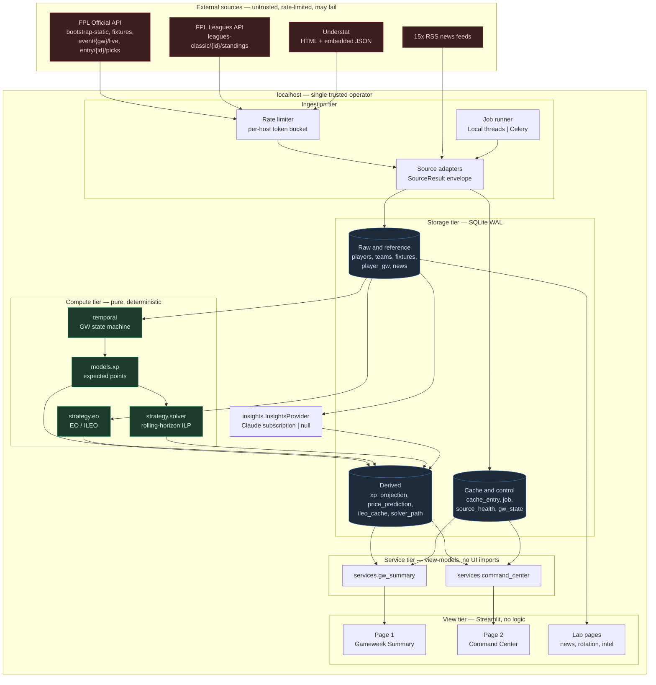
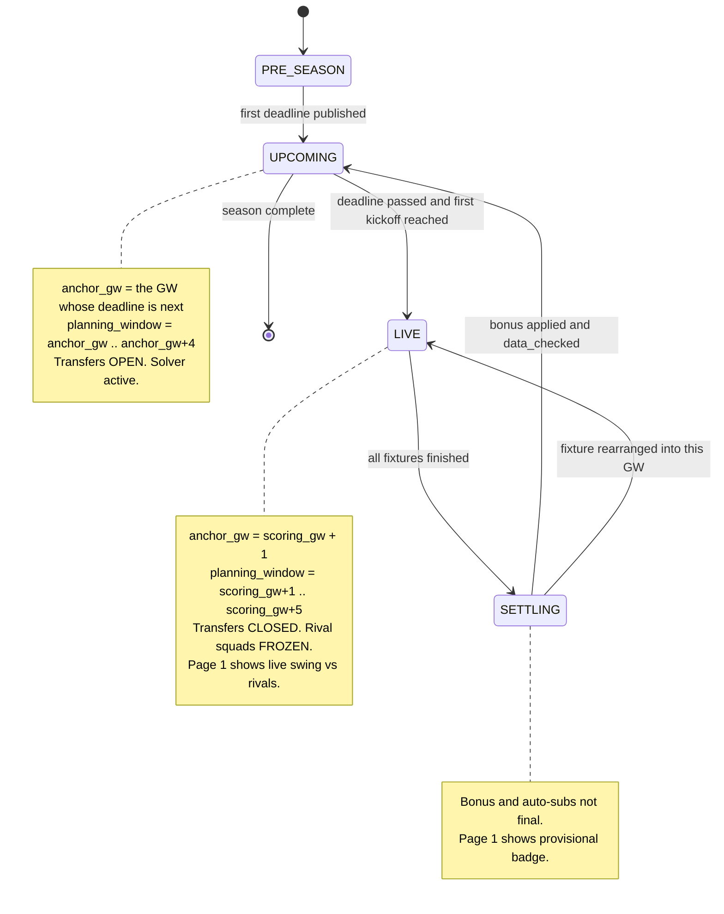
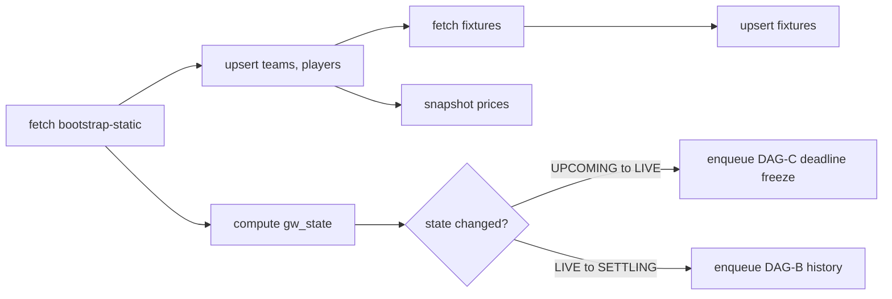
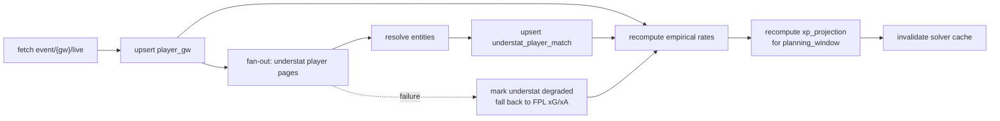
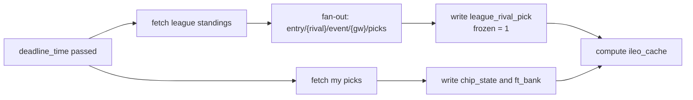
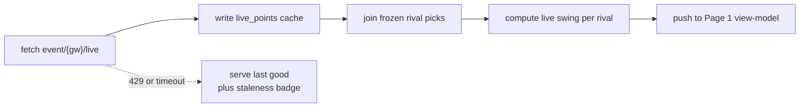
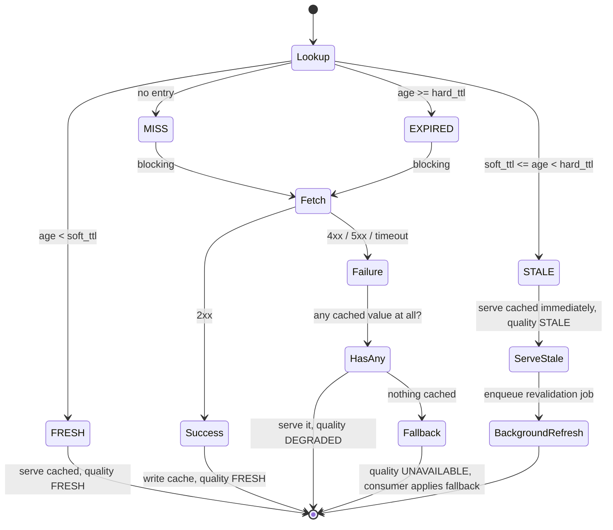
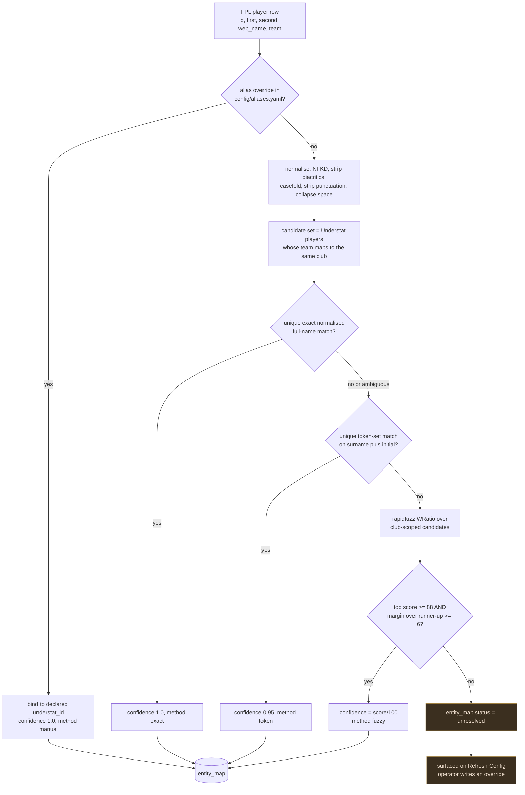

# FPL Decision Engine — System Design Document

| Field | Value |
|---|---|
| **Version** | 2.0 (supersedes `docs/archive/fpl_design_doc.v1.md`) |
| **Status** | Design baseline — approved for phased implementation |
| **Date** | 2026-09-01 |
| **Companion** | [CHANGE_REQUEST.md](CHANGE_REQUEST.md) — the file-by-file delta that implements this document |
| **Supersedes in part** | [design/technical-specification.md](design/technical-specification.md), [design/solution-design.md](design/solution-design.md) (v1 remains valid for news ingest, FTS5 search and the insights boundary) |
| **Deployment target** | Single-user, localhost, Windows 11 / macOS / Linux. No cloud dependency. £0 recurring cost. |

---

## 0. Thesis

The v1 application is a **passive stat dashboard**: it renders what the FPL API says and leaves inference to the human. Ten pages present ten independent views, and the manager performs the join in their head.

The v2 application is a **prescriptive decision engine**: it maintains an explicit model of expected points, an explicit model of who its owner is racing, and an explicit optimiser over the two. It answers three questions per week, in order:

1. **Where did my rank actually come from?** — separating process from luck, against a named rival set rather than the abstract global field.
2. **What is the highest-EV action available to me now?** — a solved transfer path, not a sorted table.
3. **What must be true for that to still be right in five weeks?** — a horizon plan with chip placement and free-transfer accounting.

Everything below serves those three questions. A feature that does not feed one of them is a v1 leftover and is listed for absorption or deletion in the companion change request.

---

## 1. Goals, non-goals, principles

### 1.1 Goals

| # | Goal | Measurable acceptance |
|---|---|---|
| G1 | Correct temporal state at all times | Post-deadline, every planning surface pivots to `GW+1..GW+5` within one page render, with zero user action |
| G2 | Prescriptive transfer output | Three ranked, budget-feasible, rule-legal transfer paths generated in < 30 s from a cold cache |
| G3 | League-relative reasoning | Every points figure on Page 1 has a paired *swing* figure against the selected rival set |
| G4 | Never blank the screen | Any single upstream source failing degrades one panel to a labelled fallback; no page raises |
| G5 | Explainability | Every recommendation exposes its component terms; no unexplained scalar reaches the UI |
| G6 | Bounded cost | Zero paid services. FPL request budget respected under a documented token bucket |

### 1.2 Non-goals

- Multi-user hosting, authentication, or a public deployment. The threat model is a single trusted operator on localhost.
- Live in-play second-by-second scoring. Live polling is 60 s and best-effort.
- Machine-learned point prediction from scratch. The xP engine is a **structured actuarial model** with shrunk empirical rates — auditable, not a black box.
- Replacing the Claude insights boundary. Free-text news interpretation stays exactly where v1 put it, behind `InsightsProvider`.

### 1.3 Principles

1. **Determinism first.** Python computes every number. The LLM is confined to turning prose into a structured availability signal. (Inherited from `.claude/CLAUDE.md`; unchanged.)
2. **The store is the contract.** Modules communicate through SQLite tables, not through in-memory objects. Any stage can be re-run independently.
3. **Degradation is a first-class state,** not an exception handler. Every read returns a `SourceResult` carrying provenance and freshness.
4. **Seasonal facts live in YAML.** Chip rules, FT caps, cup dates and aliases are configuration. A rule change must never require a code change.
5. **The UI owns no logic.** Streamlit pages call one service function and render its view-model. This keeps a future FastAPI/React front end a pure addition.

---

## 2. Architecture decision records

These are the load-bearing choices. Each one was a real fork.

### ADR-001 — Keep Streamlit; introduce a service layer instead of a SPA rewrite

**Context.** The brief calls for "clean frontend/backend modular architecture". v1 is a Streamlit multipage app where pages call analytics modules directly and hold business logic inline.

**Decision.** Keep Streamlit as the view technology. Extract every computation out of `pages/` into `fpl_assistant/services/*`, which return plain dataclass view-models with no Streamlit imports.

**Rationale.** The modularity requirement is satisfied by the *boundary*, not by the framework. A React+FastAPI rewrite costs weeks, adds a build toolchain and a second runtime to a single-user localhost app, and buys nothing the service layer does not. With the boundary in place, adding `api/main.py` exposing the same view-models over FastAPI is a ~200-line additive change if it is ever wanted.

**Consequences.** Pages become < 60 lines each. Services are unit-testable without a browser. Drag-and-drop transfer planning (§8.4) is constrained to what `streamlit-sortables` can express; a richer interaction would be the trigger to revisit this ADR.

### ADR-002 — Job queue is an abstraction; local thread runner is the default, Celery/Redis is opt-in

**Context.** The brief specifies Celery/Redis background workers.

**Decision.** Define a `JobRunner` protocol. Ship two implementations: `LocalThreadRunner` (default — `ThreadPoolExecutor` plus a SQLite `job` table for durability and status) and `CeleryRunner` (optional, behind `requirements-async.txt`).

**Rationale.** Three concrete reasons the local runner is the correct default here:

- **Windows.** Celery has had no official Windows support since 3.1; it runs only under `--pool=solo` or `--pool=threads`, which is precisely a thread pool with a broker bolted on. The primary target machine is Windows 11.
- **Workload shape.** The heavy jobs are I/O-bound HTTP fetches, not CPU-bound work. The GIL is not the bottleneck; the rate limiter is.
- **Operational cost.** Requiring the operator to run a Redis server and a worker process in order to open a dashboard violates the £0/local-first constraint and adds two failure modes to a system whose main design goal is not falling over.

Celery remains genuinely useful if the app is ever moved to a Linux box, or if ingest is split onto a schedule independent of the UI process. The abstraction makes that a config flag (`JOB_RUNNER=celery`), not a rewrite.

**Consequences.** Job durability comes from the `job` table, not from a broker. A killed UI process orphans running jobs; they are reaped as `stale` on next boot and re-enqueued. This is documented behaviour, not a bug.

### ADR-003 — Rolling-horizon Integer Linear Programming, solved with PuLP/CBC over a pruned candidate set

**Context.** Transfer planning over five gameweeks with budget, club limits, formation legality and free-transfer accumulation is a combinatorial problem. Greedy "highest xP delta" ranking cannot express "take a −4 now to enable a Bench Boost in GW+3".

**Decision.** Model as ILP. Solve with PuLP and its bundled CBC. Prune the player universe to the incumbent 15 plus the top-K per position by projected xP before building the model.

**Rationale.** CBC ships inside the `pulp` wheel — no external solver install, no licence, works offline. Pruning is what makes it tractable: the full universe (~700 players × 5 weeks × 5 variable families) is ~17.5k binaries and CBC will not close that gap in interactive time. At K = 40 per position the model is ~200 players and ~5k binaries, which CBC solves to optimality in single-digit seconds.

**Alternatives rejected.** OR-Tools CP-SAT is faster on this class but is a large dependency for one module. A hand-rolled beam search is easier to ship but loses the optimality guarantee that makes the output trustworthy as *prescription* rather than suggestion.

**Consequences.** Pruning means the solver is optimal over the candidate set, not over the league. Candidate-set construction (§7.7) is therefore part of the model's correctness, and is surfaced in the UI as "considering N candidates".

### ADR-004 — Understat by HTML-embedded-JSON scrape, treated as an enrichment, never a dependency

**Context.** Understat publishes no API. Its data is embedded in page HTML as hex-escaped `JSON.parse('...')` payloads.

**Decision.** Scrape with a regex extractor. Cache aggressively (6 h). Every consumer of Understat data must have a defined FPL-native fallback, and the UI must show which one it used.

**Rationale.** A scraped source will break — on a markup change, a rate limit, or an outage. Building xP on top of it as a hard dependency would make the whole engine as available as the least available source. FPL's own `expected_goals`/`expected_assists` in `player_gw` (already ingested in v1) are a complete, if coarser, substitute.

**Consequences.** Two xP code paths that must agree in shape. §5.3 defines the degradation matrix that keeps them interchangeable.

### ADR-005 — Rival squads are frozen at the deadline

**Context.** Mini-league rivals' picks are only knowable after each deadline, and change if fetched later (chips resolve, auto-subs apply).

**Decision.** Snapshot every selected rival's picks once, at the first fetch after the GW deadline passes, and mark that snapshot immutable for the gameweek.

**Rationale.** ILEO is only meaningful against squads that are actually locked in. Re-fetching mid-gameweek produces a moving denominator and makes swing numbers incomparable across a refresh. Immutability also caps the request budget at |R| requests per gameweek rather than per page load.

**Consequences.** Pre-deadline, the matrix shows *last* gameweek's rival squads, clearly labelled provisional. That is the honest state — nobody's team is knowable before the deadline.

---

## 3. System context



### 3.1 Trust and failure boundaries

| Boundary | Crossing | Contract |
|---|---|---|
| External → Ingest | HTTP | May fail, may rate-limit, may return malformed payloads. **Every** call returns `SourceResult`, never raises past the adapter. |
| Ingest → Store | SQLite write | Transactional per source per run. A partial fetch never half-writes a table. |
| Store → Compute | SQL read | Compute is pure: same rows in, same numbers out. No network, no clock reads except through `temporal`. |
| Compute → Service | Python call | Services compose compute outputs and attach a `DataQuality` envelope. |
| Service → View | View-model | Dataclasses only. If a service raises, the page renders a degraded card — it does not propagate. |

---

## 4. Temporal state engine

The single largest correctness defect in v1 is that `planner.next_gw()` infers the planning gameweek from `MIN(event) WHERE finished = 0`. That is wrong in three states: mid-gameweek (a live GW is unfinished, so it plans for the week already in progress), after a postponement (a rearranged fixture with a low `event` drags planning backwards), and between seasons.

### 4.1 State machine



### 4.2 Definitions

Let $E$ be the gameweek events from `bootstrap-static`, each with `deadline_time`, `is_current`, `is_next`, `finished`, `data_checked`.

$$
\text{scoring\_gw} = \begin{cases}
e : \texttt{is\_current}(e) & \text{if any} \\[2pt]
\max\{e : \texttt{finished}(e)\} & \text{otherwise}
\end{cases}
\qquad
\text{anchor\_gw} = \begin{cases}
e : \texttt{is\_next}(e) & \text{if any} \\[2pt]
\text{scoring\_gw} + 1 & \text{otherwise}
\end{cases}
$$

$$
\text{planning\_window} = \big[\,\text{anchor\_gw},\ \text{anchor\_gw} + N - 1\,\big], \qquad N = 5
$$

**The Active Focus Rule.** `anchor_gw` derives from `is_next`, which FPL flips the instant a deadline passes. The pivot to `GW+1..GW+5` therefore needs no scheduled job — it follows from the next `bootstrap-static` read. The cached event list carries `deadline_time`, so `temporal` pivots correctly even on a stale cache by comparing deadlines against the wall clock.

Three distinct gameweek concepts, never again conflated:

| Symbol | Meaning | Consumers |
|---|---|---|
| `scoring_gw` | The GW FPL is currently scoring, or last scored | Page 1 performance, live swing, variance analysis |
| `anchor_gw` | The GW whose deadline is next — the one you are picking a team for | Solver, captaincy, price predictions, all planning |
| `last_complete_gw` | Greatest GW with `finished ∧ data_checked` | Historical rate estimation, shrinkage sample counts |

### 4.3 Banked free-transfer mechanics

FPL rules current from 2024/25: free transfers accumulate to a maximum of **5**; a Wildcard or Free Hit does not consume banked transfers, and they are retained into the following gameweek.

Let $f_t$ be free transfers available entering gameweek $t$, $T_t$ the transfers made, $u_t \in \{0,1\}$ whether a squad chip (WC/FH) was active, and $F_{\max} = 5$.

Transfers consumed from the bank:

$$q_t = \begin{cases} 0 & u_t = 1 \\ \min(T_t,\ f_t) & u_t = 0 \end{cases}$$

Points hit incurred:

$$h_t = \begin{cases} 0 & u_t = 1 \\ \max(0,\ T_t - f_t) & u_t = 0 \end{cases}, \qquad \text{cost} = 4 h_t$$

Bank recurrence:

$$\boxed{\ f_{t+1} = \min\big(F_{\max},\ f_t - q_t + 1\big)\ }$$

Setting $u_t = 1$ gives $q_t = 0$ and therefore $f_{t+1} = \min(F_{\max}, f_t + 1)$ — chip retention falls out of the recurrence rather than needing a special case. This same relation is the transfer-bank constraint block in the solver (§7.7), which is why it is stated once here and referenced there.

> **Configuration, not code.** $F_{\max}$, the hit cost, and the chip-retention flag live in `config/rules.yaml`. FPL has changed the FT cap once already (2 → 5); it will change again.

---

## 5. Data pipeline, caching and resilience

### 5.1 Ingestion DAGs

Four DAGs, distinguished by trigger and cadence.


*DAG-A · Reference refresh — daily or on demand. 2 requests.*


*DAG-B · History and enrichment — after each GW settles.*


*DAG-C · Deadline freeze — once, at each deadline crossing. |R| + 2 requests.*


*DAG-D · Live polling — every 60 s while state = LIVE. 1 request.*

**Why only two steps need a worker.** DAG-A is 2 requests; DAG-D is 1. DAG-B's Understat fan-out is up to ~700 player pages on a cold start, and DAG-C's rival fan-out is |R| picks calls. Those two are the entire justification for the job runner (ADR-002); everything else runs inline in the request cycle.

### 5.2 Stale-while-revalidate cache

Every external read goes through one function:

```
get_or_revalidate(key, tier, fetch_fn) -> SourceResult
```



**Tiered TTLs.** `soft_ttl` triggers background revalidation; `hard_ttl` forces a blocking fetch.

| Tier | Key shape | soft TTL | hard TTL | Rationale |
|---|---|---|---|---|
| `fpl_static` | `fpl:bootstrap` | 24 h | 72 h | Player metadata and team strengths move slowly; prices have their own tier |
| `fpl_fixtures` | `fpl:fixtures` | 6 h | 24 h | Rearrangements land unpredictably; cheap to refetch |
| `fpl_live` | `fpl:live:{gw}` | 60 s | 5 min | Live scoring, bounded by the 60 s poll |
| `fpl_prices` | `fpl:prices:{date}` | 1 h | 6 h | Feeds the price model; needs intra-day granularity |
| `fpl_entry` | `fpl:entry:{id}:{gw}` | 15 min | 6 h | Own team, pre-deadline |
| `ml_standings` | `ml:standings:{league}` | 1 h | 12 h | League table position |
| `ml_picks` | `ml:picks:{entry}:{gw}` | **∞ once frozen** | ∞ | ADR-005. Immutable after deadline |
| `understat_player` | `us:player:{id}` | 6 h | 7 d | Enrichment; a week-old xG rate is still informative |
| `understat_league` | `us:league:{season}` | 6 h | 7 d | Bulk season table, one request |
| `understat_match` | `us:match:{id}` | ∞ | ∞ | A finished match never changes |
| `news_rss` | `rss:{feed}` | 30 min | 6 h | Unchanged from v1 |

### 5.3 Degradation matrix

The contract for G4. Each row is a failure the system is *designed* to survive.

| Failure | Detection | Behaviour | UI signal |
|---|---|---|---|
| Understat 429 / timeout / markup change | Adapter returns `UNAVAILABLE`, or the extractor finds no `JSON.parse` payload | xP engine switches its attacking-rate source to `player_gw.expected_goals/expected_assists` | `⚠ Understat Offline — Using Baseline Stats`, pinned to the panel header |
| Understat entity unresolved for player *p* | No `entity_map` row above threshold | *That player only* uses FPL rates; the rest of the squad keeps Understat | Row-level `ⓘ baseline` chip in the player table |
| FPL API 429 | HTTP 429, or token bucket exhausted | Serve last good from cache; back off with jitter; suspend non-essential fan-out jobs | `Rate limited — data as of HH:MM` in the global status bar |
| FPL API down (5xx / DNS) | 3 consecutive failures | Whole app runs from cache; ingest buttons disabled with a reason | Amber global banner plus `source_health` detail on Refresh Config |
| Mini-league picks partially fetched | fetched < \|R\| | ILEO computed over the subset retrieved; denominator adjusted | `ILEO over 8 of 12 rivals` sub-caption |
| Solver infeasible | CBC status `Infeasible` | Relax in fixed order: (1) drop chip-setup constraint, (2) allow +1 hit, (3) shorten horizon to 3, (4) fall back to greedy single-transfer ranking | `Relaxed: allowed 1 hit` chip on the path card |
| Solver timeout (> 30 s) | CBC time limit reached | Return best incumbent with its MIP gap | `Best found, gap 4.2%` chip |
| No `FPL_TEAM_ID` | Config check | Page 1 and squad-relative features disabled; market-wide views still work | Inline setup card, not a stack trace |
| Cold DB / first run | `fpl_last_ingest` null | Guided first-run sequence on Refresh Config | Skeleton loaders, no empty tables |

---

## 6. Entity resolution

FPL and Understat disagree about names in every way two systems can: transliteration (*Håland* / *Haaland*), diacritics, name order, nicknames (*Son Heung-Min* / *Son*), single-name players (*Rodri*, *Fabinho*), and duplicate surnames across clubs.

### 6.1 Pipeline



### 6.2 Why club-scoping comes first

Restricting candidates to one club before fuzzy matching is what makes the process deterministic rather than probabilistic. A 20-player candidate set with one plausible surname match is a decision; a 700-player set with six *Silva*s is a coin flip. The existing `_STOP_SURNAMES` heuristic in [entity.py](fpl_assistant/entity.py) is a symptom of matching without scope — with club scope it is unnecessary on this path. It stays in place for news tagging, where no club context exists.

**Margin requirement.** A match is accepted only if the best score clears 88 *and* beats the runner-up by 6. A high score with a close second is exactly the transfer-window case — two new signings with similar names — that produces silent mis-binding. That is the worst possible failure mode here, because it corrupts one player's xG with another's and never announces itself.

### 6.3 Stability

`entity_map` rows persist across ingests and carry `resolved_at` and `source_hash`. A re-resolution that would *change* an existing high-confidence binding is not applied silently — it is written as a `conflict` row and surfaced to the operator. Mid-season club transfers are the legitimate cause, and the operator confirms them.

---

## 7. Mathematical model specification

Notation is fixed for the whole section.

| Symbol | Meaning |
|---|---|
| $p$ | player |
| $t$ | gameweek index within the planning window, $t \in \{1..N\}$, $N=5$ |
| $f$ | a fixture; $\mathcal{F}_{p,t}$ = fixtures for $p$'s club in GW $t$ (size 0 = blank, 2 = double) |
| $\hat P_{p,t}$ | projected FPL points for $p$ in GW $t$ |
| $m_p$ | points multiplier: 0 benched/absent, 1 starting, 2 captain, 3 triple captain |
| $\mathcal{R}$ | the frozen rival set (mini-league opponents) |
| $O_p$ | global ownership fraction |

### 7.1 Minutes model

Everything multiplies through minutes, so this is estimated first and estimated carefully.

Start probability blends an empirical start rate with a positional prior, shrunk by sample size:

$$
\pi^{\text{start}}_p = \frac{n_p}{n_p + n_0} \cdot \frac{\sum_{g \in G_p} \mathbb{1}[\texttt{starts}_{p,g}]}{n_p} \;+\; \frac{n_0}{n_p + n_0} \cdot \pi^{\text{prior}}_{\text{pos}}
$$

with $n_p$ = appearances in the trailing window (recency-weighted, half-life 6 GWs) and $n_0 = 5$, matching the `PRIOR_APPEARANCES` constant already in [planner.py](fpl_assistant/planner.py).

Availability gate from FPL status, news, and the rotation score already computed by `congestion.rotation_risk`:

$$
a_p = \underbrace{\frac{c_p}{100}}_{\texttt{chance\_of\_playing}} \cdot \underbrace{\big(1 - \rho\, r_p\big)}_{\text{rotation}}, \qquad r_p \in [0,1],\ \rho = 0.35
$$

$$
\boxed{\ \hat\mu_{p,f} = a_p\Big[\pi^{\text{start}}_p\,\bar\mu^{\text{start}}_p + \big(1-\pi^{\text{start}}_p\big)\,\pi^{\text{sub}}_p\,\bar\mu^{\text{sub}}_p\Big]\ }
$$

where $\bar\mu^{\text{start}}_p$ is mean minutes when starting and $\bar\mu^{\text{sub}}_p$ mean minutes when introduced from the bench.

Appearance points:

$$\hat A_{p,f} = 1 \cdot \Pr(0 < \mu \le 59) + 2 \cdot \Pr(\mu \ge 60), \qquad \Pr(\mu \ge 60) \approx a_p\,\pi^{\text{start}}_p\,s_p$$

with $s_p$ the observed rate of completing 60+ minutes given a start.

### 7.2 Attacking returns

Per-90 rates come from Understat when resolved, FPL otherwise (ADR-004):

$$
\text{xG90}_p = \frac{\sum_{g} w_g\,\text{xG}_{p,g}}{\sum_g w_g\,\mu_{p,g}/90}, \qquad w_g = 2^{-(t_{\text{now}} - g)/\tau},\ \ \tau = 6
$$

Shrink toward the positional mean so a two-game sample cannot dominate:

$$
\widetilde{\text{xG90}}_p = \kappa_p\,\text{xG90}_p + (1-\kappa_p)\,\overline{\text{xG90}}_{\text{pos}}, \qquad \kappa_p = \frac{M_p}{M_p + M_0},\ \ M_0 = 450 \text{ minutes}
$$

Opponent and venue adjustment, using the team-strength columns already stored in `teams`:

$$
\phi_{f} = \left(\frac{\overline{S^{\text{def}}}}{S^{\text{def}}_{\text{opp}(f)}}\right)^{\alpha} \cdot \left(\frac{S^{\text{att}}_{\text{club},\,\text{venue}(f)}}{\overline{S^{\text{att}}}}\right)^{\alpha}, \qquad \alpha = 0.6
$$

Expected goals and assists in the fixture:

$$
\hat G_{p,f} = \widetilde{\text{xG90}}_p \cdot \frac{\hat\mu_{p,f}}{90}\cdot \phi_f \cdot \psi_p, \qquad
\hat A^{\text{ast}}_{p,f} = \widetilde{\text{xA90}}_p \cdot \frac{\hat\mu_{p,f}}{90}\cdot \phi_f
$$

where $\psi_p$ is the **set-piece and penalty premium**, derived from the `penalties_order`, `corners_order` and `freekicks_order` columns already ingested in v1:

$$
\psi_p = 1 + \delta_{\text{pen}}\,\mathbb{1}[\texttt{penalties\_order}=1] + \delta_{\text{sp}}\,\mathbb{1}[\texttt{freekicks\_order}\le 2]
$$

Goal points by position: $g_{\text{pos}} = \{\text{GKP}: 10,\ \text{DEF}: 6,\ \text{MID}: 5,\ \text{FWD}: 4\}$; assists 3 for all.

### 7.3 Defensive returns

Goals conceded modelled as Poisson with rate $\lambda_f$ from opponent attack against club defence:

$$\Pr(\text{CS}_f) = e^{-\lambda_f}\cdot\Pr(\mu \ge 60)$$

Clean-sheet points $cs_{\text{pos}} = \{\text{GKP}: 4,\ \text{DEF}: 4,\ \text{MID}: 1,\ \text{FWD}: 0\}$.

Concession penalty for GKP/DEF, −1 per 2 goals:

$$
\hat C_{p,f} = \sum_{k \ge 2} \left\lfloor \tfrac{k}{2} \right\rfloor \frac{\lambda_f^k e^{-\lambda_f}}{k!}\cdot\Pr(\mu \ge 60)
$$

Saves for keepers, 1 point per 3: $\hat S_{p,f} = \tfrac{1}{3}\,\overline{\text{saves90}}_p\,\tfrac{\hat\mu_{p,f}}{90}$.

**Defensive Contribution** — the 2025/26 scoring addition. `player_gw.defensive_contribution` is already ingested in v1 and currently unused by any analytic. With threshold $\theta_{\text{pos}} = \{\text{DEF}: 10,\ \text{MID/FWD}: 12\}$ actions, worth 2 points:

$$
\hat D_{p,f} = 2\,\Pr\!\left(\text{Poisson}\!\left(\overline{\text{DC90}}_p\cdot\tfrac{\hat\mu_{p,f}}{90}\right) \ge \theta_{\text{pos}}\right)
$$

This term is why a "boring" defensive midfielder can out-project a wide forward, and it is precisely the edge a passive dashboard cannot see.

### 7.4 Bonus

BPS rank within a match determines bonus (3/2/1):

$$\hat B_{p,f} = 3\Pr(\text{rank}_1) + 2\Pr(\text{rank}_2) + 1\Pr(\text{rank}_3)$$

Implemented as an empirical lookup: bucket players by $\overline{\text{BPS90}}$ decile and read historical bonus frequencies from `player_gw`. This avoids modelling 21 other players' BPS explicitly, at the cost of ignoring within-match correlation — an acceptable trade for a term worth roughly half a point.

### 7.5 Assembled expected points

$$
\boxed{\ \hat P_{p,t} = \sum_{f \in \mathcal{F}_{p,t}} \Big[\hat A_{p,f} + g_{\text{pos}}\hat G_{p,f} + 3\hat A^{\text{ast}}_{p,f} + cs_{\text{pos}}\Pr(\text{CS}_f) + \hat S_{p,f} + \hat D_{p,f} + \hat B_{p,f} - \hat C_{p,f} - \hat Y_{p,f}\Big]\ }
$$

Summing over $\mathcal{F}_{p,t}$ is what makes doubles and blanks fall out arithmetically: a blank is an empty sum (exactly zero, no special case), and a double is two terms with *different* $\phi_f$ — which is why a double against two hard opponents beats a single against a soft one only sometimes.

**Variance.** The solver's risk profiles need second moments. Modelling $P_{p,t}$ as a compound of the component distributions and using the Poisson property $\text{Var} = \text{mean}$ for goal and assist counts:

$$
\sigma^2_{p,t} \approx \sum_{f}\Big[g_{\text{pos}}^2\hat G_{p,f} + 9\hat A^{\text{ast}}_{p,f} + cs_{\text{pos}}^2\Pr(\text{CS}_f)\big(1-\Pr(\text{CS}_f)\big) + \text{Var}(\hat B_{p,f})\Big]
$$

**Correlation.** Two players from the same club are not independent — they share the clean sheet and, partly, the goals:

$$
\text{Cov}(P_i, P_j) = \begin{cases}\rho_{\text{club}}\,\sigma_i\sigma_j & \text{same club}\\ 0 & \text{otherwise}\end{cases}, \qquad \rho_{\text{club}} \approx 0.35\ \text{(defenders)},\ \ 0.15\ \text{(attackers)}
$$

This is what makes a triple-up on one club a genuinely different risk position from three players at three clubs with identical $\hat P$ — a distinction no v1 surface can express.

### 7.6 Ownership, effective ownership, ILEO

**Global effective ownership** over a reference pool $\mathcal{M}$ of managers:

$$
\text{EO}_p = \frac{1}{|\mathcal{M}|}\sum_{m \in \mathcal{M}} m^{(m)}_p = O^{\text{start}}_p + O^{\text{cap}}_p + 2\,O^{\text{tc}}_p
$$

The v1 `top_owned` table already samples $\mathcal{M}$ as a top-50k proxy via `leagues-classic/314`.

**Intra-League Effective Ownership.** The insight that matters is that global EO is the wrong denominator when you are racing eleven named people. Over the frozen rival set $\mathcal{R}$ (ADR-005):

$$\boxed{\ \text{ILEO}_p = \frac{1}{|\mathcal{R}|}\sum_{r \in \mathcal{R}} m^{(r)}_p\ }$$

**Swing** — the quantity the Page 1 matrix is built on. If $p$ scores $P_p$, your lead over the average rival changes by:

$$\Delta_p = \big(m^{\text{me}}_p - \text{ILEO}_p\big)\,P_p$$

and across the squad, the expectation and variance of the lead change:

$$
\mathbb{E}[\Delta] = \sum_p \big(m^{\text{me}}_p - \text{ILEO}_p\big)\hat P_p, \qquad
\text{Var}[\Delta] = \sum_{i,j}\big(m^{\text{me}}_i - \text{ILEO}_i\big)\big(m^{\text{me}}_j - \text{ILEO}_j\big)\text{Cov}(P_i,P_j)
$$

**Reading the sign** is the whole product feature:

| Condition | Meaning | Prescription |
|---|---|---|
| $m^{\text{me}}_p > \text{ILEO}_p$ | **Over-exposed** — you gain when $p$ hauls | You need $p$ to score |
| $m^{\text{me}}_p < \text{ILEO}_p$ | **Under-exposed** — you gain when $p$ blanks | You need $p$ to fail |
| $m^{\text{me}}_p = \text{ILEO}_p = 0$ | Mutually absent | Irrelevant — ignore entirely |
| $m^{\text{me}}_p = \text{ILEO}_p > 0$ | **Neutralised** — a shared holding | Cannot move you; do not spend a transfer here |

The last row changes behaviour most: a large fraction of a typical squad is *incapable* of affecting mini-league rank, and v1 gives no way to see it.

**Head-to-head.** Against one specific rival $r$ rather than the set mean, substitute $m^{(r)}_p$ for $\text{ILEO}_p$. The Page 1 matrix renders both — the set-mean column and a per-rival grid.

### 7.7 Rolling-horizon transfer solver

**Candidate set** (ADR-003). Let $\mathcal{S}_0$ be the incumbent 15. For each position, take the top $K$ players by $\sum_t \hat P_{p,t}$ subject to price ≤ (bank + max sale value available in that position):

$$\mathcal{P} = \mathcal{S}_0 \cup \bigcup_{\text{pos}} \text{top-}K_{\text{pos}}, \qquad K = 40$$

**Decision variables**, for $p \in \mathcal{P}$, $t \in \{1..N\}$:

| Variable | Domain | Meaning |
|---|---|---|
| $x_{p,t}$ | $\{0,1\}$ | $p$ is in the 15-man squad in GW $t$ |
| $y_{p,t}$ | $\{0,1\}$ | $p$ starts (is in the XI) |
| $c_{p,t}$ | $\{0,1\}$ | $p$ is captain |
| $b_{p,t}$ | $\{0,1\}$ | $p$ is transferred **in** at $t$ |
| $s_{p,t}$ | $\{0,1\}$ | $p$ is transferred **out** at $t$ |
| $f_t$ | $\mathbb{Z}_{[0,5]}$ | free transfers entering $t$ |
| $q_t$ | $\mathbb{Z}_{\ge 0}$ | free transfers consumed at $t$ |
| $h_t$ | $\mathbb{Z}_{\ge 0}$ | points hits taken at $t$ |
| $u_t$ | $\{0,1\}$ | a squad chip (Wildcard) is active at $t$ |
| $z_t$ | $\{0,1\}$ | auxiliary; linearises the $\min$ in the FT cap |
| $M_t$ | $\mathbb{R}_{\ge 0}$ | bank (£m) after transfers at $t$ |

**Objective:**

$$
\max\ \sum_{t=1}^{N}\gamma^{\,t-1}\Bigg[\sum_{p\in\mathcal{P}}\hat P_{p,t}\big(y_{p,t}+c_{p,t}\big) + \beta\sum_{p\in\mathcal{P}}\hat P_{p,t}\big(x_{p,t}-y_{p,t}\big)\Bigg] \;-\; 4\sum_{t=1}^{N}h_t \;+\; \mu\,f_{N+1} \;+\; \lambda\,\text{TV}_N
$$

with $\gamma = 0.90$ (horizon discount — a point next week is worth more than a projected point in five weeks, because the projection is less certain), $\beta = 0.10$ (bench weight: a bench player has option value via auto-subs but is not a starter), $\mu$ the terminal-FT valuation and $\lambda$ the team-value weight.

Captaincy enters as $c_{p,t}$ adding a *second* copy of $\hat P_{p,t}$ — exactly the doubling rule, and it keeps the objective linear.

**Constraints:**

$$
\begin{aligned}
&\text{(C1) squad size} && \textstyle\sum_{p} x_{p,t} = 15 && \forall t\\
&\text{(C2) squad quotas} && \textstyle\sum_{p \in \text{GKP}} x_{p,t} = 2,\ \sum_{\text{DEF}} = 5,\ \sum_{\text{MID}} = 5,\ \sum_{\text{FWD}} = 3 && \forall t\\
&\text{(C3) XI size} && \textstyle\sum_{p} y_{p,t} = 11 && \forall t\\
&\text{(C4) XI within squad} && y_{p,t} \le x_{p,t} && \forall p,t\\
&\text{(C5) formation} && \textstyle\sum_{\text{GKP}} y_{p,t} = 1;\ \ 3 \le \sum_{\text{DEF}} y_{p,t} \le 5;\ \ 2 \le \sum_{\text{MID}} y_{p,t} \le 5;\ \ 1 \le \sum_{\text{FWD}} y_{p,t} \le 3 && \forall t\\
&\text{(C6) one captain} && \textstyle\sum_{p} c_{p,t} = 1,\qquad c_{p,t} \le y_{p,t} && \forall t\\
&\text{(C7) club limit} && \textstyle\sum_{p \in \text{club } k} x_{p,t} \le 3 && \forall k,t\\
&\text{(C8) continuity} && x_{p,t} = x_{p,t-1} + b_{p,t} - s_{p,t},\qquad b_{p,t} + s_{p,t} \le 1 && \forall p,t\\
&\text{(C9) initial squad} && x_{p,0} = \mathbb{1}[p \in \mathcal{S}_0] && \forall p\\
&\text{(C10) budget} && M_t = M_{t-1} + \textstyle\sum_p V^{\text{sell}}_p s_{p,t} - \sum_p V^{\text{buy}}_p b_{p,t},\qquad M_t \ge 0 && \forall t\\
&\text{(C11) hits} && h_t \ge \textstyle\sum_p b_{p,t} - f_t - 15\,u_t,\qquad h_t \le 15\,(1-u_t) && \forall t\\
&\text{(C12) FT consumed} && q_t = \textstyle\sum_p b_{p,t} - h_t,\qquad q_t \le f_t,\qquad q_t \le 15\,(1-u_t) && \forall t\\
&\text{(C13) FT cap} && f_{t+1} \le F_{\max};\qquad f_{t+1} \le f_t - q_t + 1 && \forall t\\
& && f_{t+1} \ge f_t - q_t + 1 - F_{\max}z_t;\qquad f_{t+1} \ge F_{\max} - F_{\max}(1-z_t) && \forall t\\
&\text{(C14) chip budget} && \textstyle\sum_t u_t \le \chi^{\text{WC}} && \\
&\text{(C15) availability} && x_{p,t} \le \mathbb{1}\big[a_p > a_{\min}\big] && \forall p,t
\end{aligned}
$$

**(C13) is the banked-transfer rule from §4.3 in linear form.** The pair of $\ge$ constraints with indicator $z_t$ implements $f_{t+1} = \min(F_{\max},\, f_t - q_t + 1)$ exactly: $z_t = 1$ forces the cap to bind, $z_t = 0$ forces the recurrence to bind, and the objective's preference for more free transfers selects the larger feasible value. Because (C12) drives $q_t \to 0$ whenever $u_t = 1$, **Wildcard FT retention is a consequence of the model rather than a patch bolted onto it.**

**Selling price.** FPL's 50%-profit rule, applied when building $V^{\text{sell}}$:

$$
V^{\text{sell}}_p = V^{\text{buy,orig}}_p + \left\lfloor \frac{\max\big(0,\ V^{\text{now}}_p - V^{\text{buy,orig}}_p\big)}{0.2}\right\rfloor \times 0.1
$$

**Free Hit is not in this chain.** A Free Hit squad does not persist, so it breaks the recurrence in (C8). It is solved as a separate single-period problem with $\mathcal{S}_0$ restored at $t+1$, and its value compared against the chain's value at that gameweek.

**Three prescriptive paths** are three parameterisations of the same model:

| Path | Objective / constraint modification | Character |
|---|---|---|
| **Conservative — FT building** | $\sum_t h_t = 0$; raise $\mu$; $\gamma = 0.95$ | Never takes a hit, banks toward 5 FTs, values flexibility |
| **Aggressive — form chasing** | Allow $\sum_t h_t \le 2$; $\gamma = 0.75$; add differential bonus $+\eta\sum_{p,t}\hat P_{p,t}\,y_{p,t}\big(1 - \text{ILEO}_p\big)$ | Front-loads points, tolerates hits, rewards low-ILEO picks |
| **Chip setup** | Fix target $t^{\star}$; add the chip-shape constraint below; maximise chip-week value | Routes the squad toward a specific chip deployment |

Chip-shape constraints at the target gameweek $t^\star$:

$$
\begin{aligned}
\text{Bench Boost: } &\textstyle\sum_{p} x_{p,t^\star}\,\mathbb{1}\big[|\mathcal{F}_{p,t^\star}| \ge 1\big] = 15 &&\text{(all 15 have a fixture)}\\
\text{Triple Captain: } &\textstyle\sum_{p} c_{p,t^\star}\,\mathbb{1}\big[|\mathcal{F}_{p,t^\star}| \ge 2\big] = 1 &&\text{(captain has a double)}
\end{aligned}
$$

**Solve budget.** CBC, 30 s wall limit, MIP gap tolerance 1%. On timeout, return the incumbent with its gap (§5.3). Warm-start from the greedy solution so CBC has an incumbent immediately.

### 7.8 Captaincy — Shield vs Sword

Ranking captains by $\hat P$ alone is a category error: the captain choice is a *rank* decision, not a points decision. Two indices over the candidates in gameweek $t$:

$$
\text{Shield}_p = \underbrace{\text{ILEO}^{\text{cap}}_p}_{\text{how much of the field owns it}} \times \underbrace{\Pr\!\big(P_p \ge \tau_{\text{floor}}\big)}_{\text{probability of a safe return}}, \qquad \tau_{\text{floor}} = 5
$$

$$
\text{Sword}_p = \underbrace{\big(1 - \text{ILEO}^{\text{cap}}_p\big)}_{\text{differential-ness}} \times \underbrace{\Pr\!\big(P_p \ge \tau_{\text{haul}}\big)}_{\text{ceiling}}, \qquad \tau_{\text{haul}} = 12
$$

with tail probabilities from the compound distribution of §7.5 — Poisson goal and assist counts convolved with the clean-sheet Bernoulli.

**Which index governs** is a function of league state, not taste. With $G$ gameweeks remaining and deficit $\Delta_{\text{pts}}$ to the rival being chased:

$$
\text{required weekly edge} = \frac{\Delta_{\text{pts}}}{G}, \qquad
\text{regime} = \begin{cases}
\textbf{Shield} & \Delta_{\text{pts}} < 0 \quad\text{(leading)}\\[2pt]
\textbf{Shield} & 0 \le \Delta_{\text{pts}}/G < 2\\[2pt]
\textbf{Sword} & \Delta_{\text{pts}}/G \ge 2
\end{cases}
$$

The threshold of 2 points per gameweek is approximately the weekly standard deviation of the *lead* against a single rival with typical squad overlap. Below it, variance alone closes the gap and taking risk is negative EV on rank; above it, the expected-points-maximising pick is provably insufficient and only variance can close the gap.

### 7.9 Variance analysis — luck versus process

Three quantities per player for the completed gameweek:

| Quantity | Definition | Interpretation |
|---|---|---|
| Prior projection | $\hat P^{\text{pre}}_p$ — what the model forecast *before* the GW | What was expected |
| Underlying realisation | $\hat P^{\text{und}}_p$ — §7.5 recomputed with **realised** xG, xA, minutes and clean-sheet outcome | What the performance deserved |
| Actual | $P^{\text{act}}_p$ | What was scored |

$$
\underbrace{P^{\text{act}}_p - \hat P^{\text{pre}}_p}_{\text{total surprise}} = \underbrace{\big(\hat P^{\text{und}}_p - \hat P^{\text{pre}}_p\big)}_{\textbf{process }\Pi_p} + \underbrace{\big(P^{\text{act}}_p - \hat P^{\text{und}}_p\big)}_{\textbf{luck }\Lambda_p}
$$

- $\Pi_p > 0$: the player *generated* more than expected — more shots, better positions, more minutes. **Predictive.**
- $\Lambda_p > 0$: the player converted above their chances — finishing, deflections, bonus draws. **Largely not predictive.**

Forward implication, applied automatically to next week's projection:

$$
\hat P^{\text{next}}_p = \hat P^{\text{pre}}_p + \kappa_p\,\Pi_p + \epsilon\,\Lambda_p, \qquad \kappa_p = \frac{M_p}{M_p + M_0},\ \ \epsilon \approx 0.05
$$

The near-zero $\epsilon$ is the formal statement of "don't chase finishing". This is what powers the Page 1 verdict labels:

| $\Pi$ | $\Lambda$ | Verdict | Action |
|:---:|:---:|---|---|
| $+$ | $+$ | **Deserved haul** | Hold — the process backs the score |
| $-$ | $+$ | **Fortunate** | Sell candidate — the score will not repeat |
| $+$ | $-$ | **Unlucky** | **Buy candidate** — the returns are coming |
| $-$ | $-$ | **Genuinely poor** | Sell |

The $(+,-)$ cell is the highest-value output of the whole page: it is the only systematic way to buy a player *before* the market prices them in.

### 7.10 Price change prediction

FPL's price algorithm is undisclosed. Changes are driven by net transfer flow normalised against the ownership base, with a per-player throttle after a change. Model it as such and calibrate empirically.

Net transfer momentum over the window since the last price change:

$$m_p = \frac{\text{NT}_p}{\max\big(1,\ O_p \cdot U\big)}, \qquad U = \text{total active managers}$$

Since v1 stores only the *current* `transfers_in_event`, this requires the new `price_snapshot` time series to recover $\dot m_p$ — the flow *rate*, which matters more than the level.

Two-stage rollout:

1. **Rule-based (day 1).** Rise flag when $m_p > \theta^{+}$ and hours-since-change > 12; fall flag when $m_p < \theta^{-}$. Thresholds seeded from published community values, then recalibrated against observations.
2. **Logistic (after ≥ 200 observed changes accumulate in `price_snapshot`).**

$$
\Pr(\text{rise}_p) = \sigma\!\big(\beta_0 + \beta_1 m_p + \beta_2 \dot m_p + \beta_3\log(1 + \text{hours since change}) + \beta_4 O_p\big)
$$

**Where this enters the engine:** as a *tiebreak and timing* term, never a primary driver. Team value is worth roughly 0.1–0.3 points per gameweek of squad quality over a season; a wrong transfer is worth several points immediately. The solver carries it at weight $\lambda$, deliberately small, and the UI states the trade-off explicitly rather than letting price panic drive decisions.

---

## 8. UX / UI blueprints

### 8.1 Information architecture

v1 has ten sibling pages of equal weight, and the manager must know which to open. v2 has **two decision surfaces** and a demoted lab.

```
⚽ FPL Decision Engine
├── 0_Gameweek_Summary.py      ← PAGE 1 · "what just happened, and against whom"
├── 1_Command_Center.py        ← PAGE 2 · "what to do next"
├── 2_My_Squad.py                (retained, unchanged in substance)
├── ─── Lab ───────────────────  (collapsed section; specialist tools)
│   ├── 3_News_Feed.py
│   ├── 4_Rotation_and_Congestion.py
│   ├── 5_Squad_Intelligence.py
│   ├── 6_Role_Arbitrage.py
│   └── 7_Squad_Briefing.py
└── 8_Refresh_Config.py          (control panel + source health)
```

Four v1 pages are **absorbed**, not discarded: Transfer Market → Command Center tab 5; Template & Differentials → Page 1 tab 2; Captaincy → Command Center tab 2; Fixture Planner → Command Center tab 3. Their computation modules survive; only the page shells go. Each was a fragment of a decision, and a fragment forces the human to perform the join.

### 8.2 Page 1 — Gameweek Performance & Mini-League Targets

```
┌────────────────────────────────────────────────────────────────────────────────────┐
│  GW 14 · LIVE                                    ⚠ Understat Offline — Baseline    │
│  ● 6 of 10 fixtures complete · updated 14:32:07 · next refresh 60s                 │
├────────────────────────────────────────────────────────────────────────────────────┤
│  ┌──────────┐ ┌──────────┐ ┌──────────┐ ┌──────────┐ ┌──────────────────────────┐  │
│  │ GW PTS   │ │ vs AVG   │ │ ML RANK  │ │ LEAD Δ   │ │ LUCK INDEX               │  │
│  │   58     │ │  +12     │ │  3 → 2 ▲ │ │  +7 pts  │ │  ▁▃█▅▂  +4.2 (fortunate) │  │
│  │ 3 to play│ │  avg 46  │ │ of 12    │ │ vs 2nd   │ │  xP 53.8 · actual 58.0   │  │
│  └──────────┘ └──────────┘ └──────────┘ └──────────┘ └──────────────────────────┘  │
├────────────────────────────────────────────────────────────────────────────────────┤
│  [ Swing Matrix ]  [ Template ]  [ Variance: Luck vs Process ]  [ Bench & Autosubs ]│
├────────────────────────────────────────────────────────────────────────────────────┤
│  RIVAL SET  ▸ 5 of 11 selected     [ Ashley ×][ Dev ×][ Priya ×][ Tom ×][ Raj ×][+] │
│                                                                                     │
│  INTRA-LEAGUE EFFECTIVE OWNERSHIP MATRIX          frozen at GW14 deadline 11:00     │
│  ┌───────────────┬──────┬──────┬──────────┬────┬────┬────┬────┬────┬──────────────┐ │
│  │ Player        │ Pts  │ Mine │  ILEO    │ Ash│ Dev│Priy│ Tom│ Raj│ Swing        │ │
│  ├───────────────┼──────┼──────┼──────────┼────┼────┼────┼────┼────┼──────────────┤ │
│  │ Salah    (C)  │  18  │  2.0 │   1.4    │ 2  │ 1  │ 1  │ 2  │ 1  │ ███▶  +10.8  │ │
│  │ Haaland       │   2  │  1.0 │   1.8    │ 2  │ 2  │ 1  │ 2  │ 2  │ ◀█    −1.6   │ │
│  │ Saka          │   9  │  0.0 │   0.8    │ 1  │ 1  │ 1  │ 0  │ 1  │ ◀████ −7.2   │ │
│  │ Gvardiol      │   6  │  1.0 │   1.0    │ 1  │ 1  │ 1  │ 1  │ 1  │ ═ neutralised│ │
│  │ Mbeumo        │  12  │  1.0 │   0.2    │ 0  │ 0  │ 1  │ 0  │ 0  │ ███▶  +9.6   │ │
│  └───────────────┴──────┴──────┴──────────┴────┴────┴────┴────┴────┴──────────────┘ │
│                                                                                     │
│  ▸ NEEDS TO HAUL   Salah(C) · Mbeumo · Isak      you own, the field mostly doesn't  │
│  ▸ NEEDS TO BLANK  Saka · Palmer                 the field owns, you don't          │
│  ▸ IRRELEVANT      Gvardiol · Raya · 4 more      shared — cannot move your rank     │
│                                                                                     │
│  NET EXPECTED SWING  +11.6 pts  (σ 9.4)   ▸ 78% chance of gaining on the set mean   │
└────────────────────────────────────────────────────────────────────────────────────┘
```

**Variance tab:**

```
┌────────────────────────────────────────────────────────────────────────────────────┐
│  LUCK vs PROCESS · GW14                    ⓘ x-axis = process (repeatable)          │
│                                              y-axis = luck (not repeatable)         │
│      luck Λ ▲                                                                       │
│        +8  │        ·Isak                    │  ·Salah                              │
│            │   FORTUNATE                     │   DESERVED HAUL                      │
│        +4  │   sell candidate                │   hold                               │
│            │                    ·Raya        │        ·Mbeumo                       │
│   ─────────┼─────────────────────────────────┼────────────────────────▶ process Π   │
│            │            −4                   0            +4                        │
│        −4  │   GENUINELY POOR                │   UNLUCKY                            │
│            │   sell                          │   ★ BUY CANDIDATE                    │
│        −8  │   ·Havertz                      │   ·Gvardiol   ·Semenyo               │
│                                                                                     │
│  ★ UNLUCKY — the market has not priced these in yet                                 │
│  ┌──────────┬─────┬──────┬──────┬───────┬──────────────────────────────────────┐   │
│  │ Player   │ Pts │  xP  │  Π   │   Λ   │ Evidence                             │   │
│  ├──────────┼─────┼──────┼──────┼───────┼──────────────────────────────────────┤   │
│  │ Gvardiol │  2  │ 6.8  │ +1.9 │ −4.8  │ xG 0.62, 4 big chances, CS lost 88'  │   │
│  │ Semenyo  │  1  │ 5.4  │ +2.2 │ −4.4  │ xG 0.71 xA 0.33, 5 shots in box      │   │
│  └──────────┴─────┴──────┴──────┴───────┴──────────────────────────────────────┘   │
└────────────────────────────────────────────────────────────────────────────────────┘
```

**Component tree:**

```
GameweekSummaryPage
├── <TemporalHeader>                     gw_state, live/settled, countdown
│   └── <DataQualityBar>                 badges: understat, rate-limit, staleness
├── <KpiRow>                             5x <MetricCard> — skeleton until view-model resolves
├── <TabGroup>
│   ├── SwingMatrixTab
│   │   ├── <RivalSelector>              multiselect, persisted to config/leagues.yaml
│   │   ├── <FreezeNotice>               "frozen at deadline HH:MM" | "pre-deadline: provisional"
│   │   ├── <ILEOMatrix>                 dataframe; column_config.BarColumn for Swing
│   │   ├── <SwingBuckets>               haul / blank / irrelevant partitions
│   │   └── <NetSwingSummary>            E[Δ], σ[Δ], P(gain) from §7.6
│   ├── TemplateTab                      (absorbs pages/4) top-50k EO vs mine
│   ├── VarianceTab
│   │   ├── <LuckProcessScatter>         four-quadrant, altair
│   │   └── <BuyCandidateTable>          Π>0 ∧ Λ<0, sorted by |Λ|
│   └── BenchTab                         autosub outcomes, bench regret
└── <ProvenanceFooter>                   per-source timestamps, request counts
```

**State boundaries:**

| State | Trigger | Render |
|---|---|---|
| `SKELETON` | View-model not resolved | Placeholder blocks at final dimensions — no layout shift on arrival |
| `PARTIAL` | Rival fan-out incomplete | Matrix renders with retrieved rivals; missing columns show `⋯` and a "fetching 4 of 11" caption |
| `FROZEN` | Post-deadline | Lock icon; rival columns immutable |
| `PROVISIONAL` | State = `SETTLING` | Amber "bonus not final" strip; bonus columns italicised |
| `DEGRADED` | Understat unavailable | Variance tab uses FPL xG/xA; persistent badge; evidence column drops shot-level detail |
| `EMPTY` | No `FPL_TEAM_ID`, or no rivals selected | Inline setup card naming the exact action — never a blank page |

### 8.3 Page 2 — Strategic Command Center

```
┌────────────────────────────────────────────────────────────────────────────────────┐
│  COMMAND CENTER · planning GW15–GW19          FT bank 2 ▪▪▫▫▫  £0.4m  TV £102.3m   │
│  deadline Sat 11:00 · in 2d 19h                            risk ▸ (○ Cons ● Aggr)  │
├────────────────────────────────────────────────────────────────────────────────────┤
│ [ Transfer Paths ] [ Captaincy Matrix ] [ Chip Timeline ] [ Squad Board ] [ Market ]│
├────────────────────────────────────────────────────────────────────────────────────┤
│  SOLVED PATHS                       200 candidates · CBC optimal · 6.2s · gap 0.0%  │
│  ┌────────────────────────┐ ┌────────────────────────┐ ┌────────────────────────┐  │
│  │ ① CONSERVATIVE         │ │ ② AGGRESSIVE      ★rec │ │ ③ CHIP SETUP → BB GW17 │  │
│  │ FT building · 0 hits   │ │ form chasing · −4      │ │ route to Bench Boost   │  │
│  │ ─────────────────────  │ │ ─────────────────────  │ │ ─────────────────────  │  │
│  │ GW15  roll (FT→3)      │ │ GW15  Saka → Mbeumo    │ │ GW15  Rico → Kerkez    │  │
│  │ GW16  Havertz→ Wissa   │ │       Havertz→ Isak −4 │ │ GW16  roll             │  │
│  │ GW17  roll (FT→3)      │ │ GW16  roll             │ │ GW17  ×2 → all 15 play │  │
│  │ GW18  ×2 Rico,Sarr     │ │ GW17  Gvardiol→ Virgil │ │       ▶ PLAY BENCH BOOST│  │
│  │ GW19  roll             │ │ GW18  roll             │ │ GW18  roll             │  │
│  │ ─────────────────────  │ │ ─────────────────────  │ │ ─────────────────────  │  │
│  │ Σ xP    271.4          │ │ Σ xP    284.1          │ │ Σ xP    278.6          │  │
│  │ hits      0            │ │ hits     −4            │ │ hits      0            │  │
│  │ net     271.4          │ │ net     280.1  ▲ +8.7  │ │ net     278.6  ▲ +7.2  │  │
│  │ end FT    3            │ │ end FT    1            │ │ end FT    1  + BB spent│  │
│  │ σ        22.1          │ │ σ        31.8          │ │ σ        26.4          │  │
│  │ [ inspect ] [ apply ]  │ │ [ inspect ] [ apply ]  │ │ [ inspect ] [ apply ]  │  │
│  └────────────────────────┘ └────────────────────────┘ └────────────────────────┘  │
│                                                                                     │
│  TOP 10 PRESCRIPTIVE MOVES                             sorted by 5-GW EV delta      │
│  ┌────┬──────────────┬───────────────┬──────┬───────┬──────┬──────┬─────────────┐  │
│  │ #  │ OUT          │ IN            │ Δ£   │ ΔxP5  │ ILEO │ Δ£pr │ Rationale   │  │
│  ├────┼──────────────┼───────────────┼──────┼───────┼──────┼──────┼─────────────┤  │
│  │ 1  │ Havertz 8.0  │ Isak 9.2      │ −1.2 │ +8.4  │ 0.18 │ ▲ 68%│ fixtures ▲▲ │  │
│  │ 2  │ Saka 10.1    │ Mbeumo 8.4    │ +1.7 │ +5.1  │ 0.06 │ ▲ 41%│ Π+ Λ− buy   │  │
│  │ 3  │ Rico 4.4     │ Kerkez 4.8    │ −0.4 │ +4.9  │ 0.02 │ ▼ 22%│ DefCon edge │  │
│  └────┴──────────────┴───────────────┴──────┴───────┴──────┴──────┴─────────────┘  │
└────────────────────────────────────────────────────────────────────────────────────┘
```

**Captaincy Matrix tab:**

```
┌────────────────────────────────────────────────────────────────────────────────────┐
│  CAPTAINCY · GW15        league state: 2nd, −7 to leader, 24 GWs left               │
│  required edge 0.29 pts/GW  →  ▶ REGIME: SHIELD   (protect; deficit closes on form) │
│                                                                                     │
│         ceiling P(≥12) ▲                                                            │
│              0.45  │                              ·Haaland                          │
│                    │   ◆ SWORD                    │        ◆ SHIELD                 │
│              0.35  │   differential swings        │        field-matching           │
│                    │        ·Mbeumo               │   ·Salah ★                      │
│              0.25  │   ·Semenyo                   │        ·Palmer                  │
│                    │                              │                                 │
│              0.15  │   ·Sarr        ·Wissa        │   ·Saka                         │
│              ──────┴──────────────────────────────┴──────────────────────▶ ILEO_cap │
│                   0.0        0.2        0.4       0.6        0.8        1.0         │
│                                                                                     │
│  ┌──────────┬──────┬──────────┬────────┬────────┬─────────┬───────────────────────┐ │
│  │ Player   │  xP  │ ILEO_cap │ Shield │ Sword  │ P(≥12)  │ Fixture               │ │
│  ├──────────┼──────┼──────────┼────────┼────────┼─────────┼───────────────────────┤ │
│  │ Salah ★  │ 7.9  │  0.62    │ 0.44 ▲ │  0.13  │  0.34   │ SOU (H) FDR 2         │ │
│  │ Haaland  │ 8.4  │  0.71    │ 0.41   │  0.12  │  0.42   │ EVE (A) FDR 3         │ │
│  │ Mbeumo   │ 6.1  │  0.08    │ 0.06   │  0.29 ▲│  0.31   │ IPS (H) FDR 2         │ │
│  └──────────┴──────┴──────────┴────────┴────────┴─────────┴───────────────────────┘ │
│  ▶ RECOMMENDATION  Salah (C).  Shield regime: you lead the chasing pack on process; │
│    Mbeumo's +0.16 Sword edge does not justify 0.54 of unmatched downside here.      │
└────────────────────────────────────────────────────────────────────────────────────┘
```

**Chip Timeline tab:**

```
┌────────────────────────────────────────────────────────────────────────────────────┐
│  CHIP HORIZON                                          available: WC2 · BB · TC · FH│
│                                                                                     │
│   GW  15    16    17    18    19    20    21    22    23    24    25    26          │
│       ──────────────────────────────────────────────────────────────────────        │
│ shape  ●     ●    ◆DGW   ●   ○BGW   ●     ●    ◆DGW   ●     ●     ●     ●          │
│ squad 15/15 15/15 15/15 14/15  9/15 15/15 15/15 13/15 15/15 15/15  —     —          │
│ fixt   10    10    14     9     6    10    10    13    10    10    ?     ?          │
│       ──────────────────────────────────────────────────────────────────────        │
│  BB          ░░░░░▓▓▓▓▓█████░░░░░                     ░░░▓▓▓░░                      │
│              ▲ target GW17 · EV +18.4 · confidence HIGH (15/15 have fixtures)       │
│  TC                       ░░░░░░░░░░░░░░░░░░░░░░░░░░░░█████                         │
│              ▲ target GW22 · EV +9.1 · confidence MED (Haaland DGW projected)       │
│  FH                             █████                                               │
│              ▲ target GW19 · EV +14.2 · confidence HIGH (only 9 of 15 play)         │
│  WC2   ▓▓▓▓▓░░░░░                                                                   │
│              ▲ hold · no structural need; squad EV within 3.1 of optimal            │
│       ──────────────────────────────────────────────────────────────────────        │
│  ⚠ GW19 blank is PROJECTED from config/calendar.yaml (FA Cup R4 collision),         │
│    not confirmed by the FPL fixture list. 6 clubs at risk. Re-check after R3 draw.  │
└────────────────────────────────────────────────────────────────────────────────────┘
```

**Component tree:**

```
CommandCenterPage
├── <TemporalHeader>                     anchor_gw, deadline countdown, FT pips, bank, TV
│   └── <RiskProfileToggle>              conservative | aggressive — re-parameterises solver
├── <SolverStatusStrip>                  candidate count, status, elapsed, MIP gap
├── <TabGroup>
│   ├── TransferPathsTab
│   │   ├── <PathCard> ×3                weekly move list, Σ xP, hits, end-FT, σ
│   │   │   ├── <PathInspector>          per-GW breakdown; why each move; binding constraints
│   │   │   └── <ApplyButton>            writes to planned_move (never to FPL — read-only API)
│   │   ├── <PrescriptiveMovesTable>     top-10 by ΔxP over the horizon
│   │   └── <TransferPlanner>            drag-and-drop scratchpad (§8.4)
│   ├── CaptaincyTab
│   │   ├── <RegimeBanner>               shield/sword regime plus the arithmetic behind it
│   │   ├── <ShieldSwordScatter>         ILEO_cap × P(haul)
│   │   └── <CaptainTable>
│   ├── ChipTimelineTab
│   │   ├── <HorizonGrid>                shape / squad coverage / fixture count per GW
│   │   ├── <ChipHeatStrips>             per-chip EV ribbon across the horizon
│   │   └── <ProjectionCaveat>           confirmed vs projected provenance
│   ├── SquadBoardTab                    current XI and bench, xP per player
│   └── MarketTab                        (absorbs pages/3) price predictions, ownership flow
└── <AssumptionsDrawer>                  every weight, TTL and constant in play — expandable
```

### 8.4 Drag-and-drop transfer planning

**Interaction.** A two-column scratchpad: current squad on the left, planned squad on the right. Dragging a player from left to right marks them OUT; dragging a market candidate in marks them IN. The planner re-validates on every drop.

**Implementation.** `streamlit-sortables` for the drag surface, with validation and re-projection in the service layer. Streamlit reruns the whole script per interaction, so the constraint check must complete in under ~100 ms. It is pure arithmetic over 15 rows, so this is comfortable; the xP re-projection reads from `xp_projection` rather than recomputing.

**Live validation, shown as you drag:**

```
┌────────────────── PLANNED XI ─────────────────────────────────────────┐
│  ✓ 15 players    ✓ 2/5/5/3 quota    ✗ 4 × Arsenal — max 3            │
│  ✓ formation 3-5-2                  ✓ bank £0.4m → £0.1m             │
│  ⚠ 3 transfers, 2 FT → −4 hit       Σ xP GW15 62.1 (+4.8 vs current) │
└───────────────────────────────────────────────────────────────────────┘
```

Invalid states are *shown*, not prevented — blocking a drop mid-plan makes the tool unusable, because a legal end state often passes through an illegal intermediate one. The Apply button is what is disabled while invalid, with the failing constraint named.

**Boundary.** The planner writes to a local `planned_move` table only. The app uses the public read-only FPL API and never posts a transfer. This is stated in the UI so the operator is never unsure whether a click did something to their real team.

### 8.5 Loading, skeleton and degraded states — global rules

1. **Never render an empty table.** Every table has a skeleton (fixed-height shimmer rows at final column widths) and an empty state naming the action that fills it.
2. **Never block the page on a fan-out.** Rival picks and Understat data fetch progressively; the page renders with what it has and fills in.
3. **Staleness is always visible.** Every panel sourced from cache carries an age; beyond `soft_ttl` it renders amber, beyond `hard_ttl` red.
4. **Degradation is labelled at the point of use,** not only globally. If the variance chart is running on FPL xG instead of Understat, the badge is on the chart.
5. **No stack traces reach the operator.** Service-layer exceptions render an error card naming the failing source, the last good timestamp, and a retry that enqueues a job.

---

## 9. Performance budgets and observability

| Surface | Budget | Enforcement |
|---|---|---|
| Page 1 first paint (warm cache) | < 400 ms | View-models read pre-computed `ileo_cache`; no solver, no network |
| Page 1 full render including live | < 1.2 s | `fpl_live` cache at 60 s; joins in SQL, not pandas |
| Page 2 with cached solver run | < 600 ms | `solver_path` read; re-solve only on invalidation |
| Solver cold solve | < 30 s hard cap | CBC time limit; incumbent returned with gap |
| xP recompute, full universe × 5 GW | < 8 s | Vectorised over pandas; single pass over `player_gw` |
| Understat cold ingest (~700 players) | < 45 min, background | Rate-limited 1 req / 3 s; never blocks the UI |
| Rival freeze fan-out (12 rivals) | < 30 s, background | 1 req/s within the FPL budget |
| DB size after a full season | < 400 MB | `player_gw` and news retention policy; VACUUM on the weekly job |

**Observability** — all local, all in SQLite:

- `source_health` — per source: last success, last failure, consecutive failures, p50/p95 latency, requests in the current window. Rendered on Refresh Config.
- `job` — every enqueued job with state, attempts, duration, error. A stuck queue is visible, not mysterious.
- `solver_run` — every solve: candidate count, status, wall time, MIP gap, objective, which relaxations fired. This is the audit trail that makes a recommendation defensible.
- Structured logging to `data/app.log` with a rotating handler; request-budget consumption is logged at every call.

---

## 10. Security and privacy

Unchanged in posture from v1, restated because the surface grew:

- **No credentials anywhere.** Every FPL endpoint used is public and unauthenticated. The app cannot make a transfer and does not accept an FPL password.
- **Rival data is public league data,** fetched from public endpoints, stored locally, never transmitted anywhere.
- **No telemetry.** Nothing leaves the machine except the outbound fetches listed in §3.
- **`.env` stays git-ignored;** `FPL_TEAM_ID` and league IDs are the only identifiers stored.
- **Scraping etiquette:** identifying User-Agent, conservative rate limits, backoff on 429, cache-first. The Understat adapter is a well-behaved client and its request budget is capped in config.
- **The LLM boundary is unchanged:** only news text crosses it, only via `InsightsProvider`, and only when `INSIGHTS_PROVIDER=claude`.

---

## Appendix A — Notation

| Symbol | Meaning | Defined in |
|---|---|---|
| $\hat P_{p,t}$ | Projected points, player $p$, gameweek $t$ | §7.5 |
| $\hat\mu_{p,f}$ | Expected minutes in fixture $f$ | §7.1 |
| $\pi^{\text{start}}_p$ | Start probability | §7.1 |
| $\phi_f$ | Opponent and venue adjustment | §7.2 |
| $\psi_p$ | Set-piece premium | §7.2 |
| $\kappa_p$ | Empirical-Bayes shrinkage weight | §7.2, §7.9 |
| $\text{EO}_p$ / $\text{ILEO}_p$ | Effective / intra-league effective ownership | §7.6 |
| $\Delta_p$ | Rank swing contribution | §7.6 |
| $\Pi_p$ / $\Lambda_p$ | Process / luck decomposition | §7.9 |
| $f_t, q_t, h_t, u_t$ | FT bank, FT consumed, hits, chip active | §4.3, §7.7 |
| $\gamma, \beta, \mu, \lambda, \eta$ | Horizon discount, bench weight, terminal-FT value, TV weight, differential bonus | §7.7 |
| $\mathcal{R}$ | Frozen rival set | §7.6 |
| $\mathcal{P}$ | Pruned solver candidate set | §7.7 |

## Appendix B — Configuration surface

| File | Owns | Changes without code |
|---|---|---|
| `.env` | Identity and runtime mode: `FPL_TEAM_ID`, `FPL_LEAGUE_IDS`, `JOB_RUNNER`, `UNDERSTAT_ENABLED`, `SOLVER_TIME_LIMIT` | ✓ |
| `config/rules.yaml` | **New.** FT cap, hit cost, chip retention, squad quotas, formation bounds, position point values, DefCon thresholds | ✓ |
| `config/aliases.yaml` | **New.** FPL ↔ Understat manual overrides | ✓ |
| `config/leagues.yaml` | **New.** Tracked mini-leagues, default rival sets | ✓ |
| `config/solver.yaml` | **New.** $\gamma, \beta, \mu, \lambda, \eta$, candidate $K$, time limit, relaxation ladder | ✓ |
| `config/calendar.yaml` | Cup rounds, international breaks, European competitions (v1, unchanged) | ✓ |
| `config/sources.yaml` | RSS feeds (v1, unchanged) | ✓ |
| `config/regions.yaml` | Region → country mapping (v1, unchanged) | ✓ |

## Appendix C — Glossary

**Anchor GW** — the gameweek whose deadline is next; the one you are picking a team for.
**BGW / DGW** — blank / double gameweek: a club plays zero / two fixtures.
**DefCon** — defensive contribution points, 2 pts at a per-position action threshold.
**EO** — effective ownership: ownership weighted by captaincy multiplier.
**FT** — free transfer. Accumulates to 5; retained through Wildcard and Free Hit.
**Hit** — a −4 point charge for a transfer beyond the free allowance.
**ILEO** — intra-league effective ownership: EO measured over your actual rivals, not the global field.
**Process (Π)** — the repeatable, underlying-stats component of a performance.
**Luck (Λ)** — the non-repeatable, conversion-driven component.
**Shield / Sword** — captaincy regimes: match the field's exposure, or take unmatched variance to close a deficit.
**Swing** — points gained on a rival per point a player scores, given the ownership difference.
**SWR** — stale-while-revalidate: serve cached data immediately, refresh in the background.
**TV** — team value.
